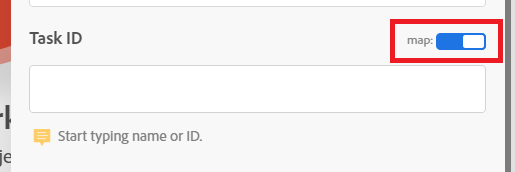

# Créer un scénario de base

Le rôle d’Adobe Workfront Fusion est d’automatiser vos processus afin que vous puissiez vous concentrer sur de nouvelles tâches plutôt que de répéter les mêmes tâches encore et encore. La plateforme fonctionne en liant les actions dans et entre les applications et les services pour créer un scénario qui transfère et transforme vos données automatiquement. Le scénario que vous créez recherche les données dans une application ou un service et traite ces données pour obtenir le résultat souhaité.

Cet exemple vous guide tout au long du processus de création d’un scénario qui recherche une requête dans Workfront et la convertit en projet.

## Conditions d’accès

+++ Développez pour afficher les exigences d’accès aux fonctionnalités de cet article.

Vous devez disposer des accès suivants pour utiliser les fonctionnalités de cet article :

<table style="table-layout:auto">
 <col> 
 <col> 
 <tbody> 
  <tr> 
   <td role="rowheader">Package Adobe Workfront</td> 
   <td> 
Tous
 </td> 
  </tr> 
  <tr data-mc-conditions=""> 
   <td role="rowheader">Licence Adobe Workfront</td> 
   <td> 
Nouveau : Standard

Ou

Actuelle : [!UICONTROL Work] ou niveau supérieur
 </td> 
  </tr> 
  <tr> 
   <td role="rowheader">Licence Adobe Workfront Fusion **</td> 
   <td>
   
Actuel : aucune exigence de licence Workfront Fusion.

   
Ou

   
Héritée : n’importe laquelle. 

   </td> 
  </tr> 
  <tr> 
   <td role="rowheader">Produit</td> 
   <td>
   
Nouveau :
 <ul><li>Plan Workfront [!UICONTROL Select] ou [!UICONTROL Prime] : votre entreprise doit acheter Adobe Workfront Fusion.</li><li>Plan Workfront [!UICONTROL Ultimate] : Workfront Fusion est inclus.</li></ul>
   
Ou

   
Actuel : votre entreprise doit acheter Adobe Workfront Fusion.

   </td> 
  </tr>
 </tbody> 
</table>

Pour plus d’informations sur les informations contenues dans ce tableau, voir [Conditions d’accès requises dans la documentation](/help/workfront-fusion/references/licenses-and-roles/access-level-requirements-in-documentation.md).

Pour plus d’informations sur les licences Adobe Workfront Fusion, voir [Licences Adobe Workfront Fusion](/help/workfront-fusion/set-up-and-manage-workfront-fusion/licensing-operations-overview/license-automation-vs-integration.md).

+++

## Créer un scénario pratique

### Commencer à créer le scénario

1. Dans la zone **Scénarios**, cliquez sur **Créer un scénario**.

   Pour localiser la zone des Scénarios, voir [Accès à Workfront Fusion](/help/workfront-fusion/get-started-with-fusion/navigate-fusion/navigate-workfront-fusion.md).

   L’éditeur de scénarios s’affiche, contenant un module vide au centre.

1. Sélectionnez le nom de l’espace réservé **[!UICONTROL Nouveau scénario]** dans le coin supérieur gauche, puis saisissez un nom.
1. Continuez avec [ Ajouter et configurer le premier module ](#add-and-configure-the-first-module).

### Ajouter et configurer le premier module

1. Cliquez sur le module vide pour choisir l’application à partir de laquelle vous allez sélectionner un module.

   Une liste d&#39;applications s&#39;affiche à droite du module.

1. Sélectionnez **Adobe Workfront**. S’il n’est pas visible, cliquez sur la barre de recherche au bas de la liste, saisissez « Workfront », puis sélectionnez-le lorsqu’il apparaît dans la liste.

   La liste est modifiée afin d’afficher tous les modules Workfront que vous pouvez utiliser.

1. Cliquez sur le module **[!UICONTROL Search]**.

   La fenêtre de configuration du module s’ouvre.

1. Dans la zone [!UICONTROL Connexion], sélectionnez votre connexion Workfront.

   Si vous ne disposez pas d’une connexion Workfront, voir [Créer une connexion](/help/workfront-fusion/create-scenarios/connect-to-apps/connect-to-fusion-general.md)
1. Dans la zone [!UICONTROL Type d’enregistrement], sélectionnez **[!UICONTROL Événement]**. Cette option permet au module de rechercher uniquement les événements, notamment les requêtes.

   Vous pouvez trouver **[!UICONTROL Problème]** dans la liste si vous commencez à saisir le mot « [!UICONTROL Problème]. »

1. Dans la zone **[!UICONTROL Jeu de résultats]**, sélectionnez **[!UICONTROL Premier enregistrement correspondant]**.

   Cela définit le module pour renvoyer uniquement le premier enregistrement qu’il trouve et qui répond aux critères.
1. Dans la zone **[!UICONTROL Critères de recherche]**, configurez les critères pour renvoyer la tâche spécifique.

   1. Dans la première zone sous [!UICONTROL Critères de recherche], sélectionnez le champ à inclure dans la recherche. Pour cet exemple, sélectionnez **[!UICONTROL Nom]**.

      Vous pouvez trouver **[!UICONTROL Nom]** dans la liste si vous commencez à saisir le mot « [!UICONTROL nom] ».
   1. Pour l’opérateur/opératrice, cliquez sur la flèche de liste déroulante en regard de **Exist** et remplacez-la par [!UICONTROL **Contient (non-respect de la casse)**].

      Cela permet au module de trouver des projets dont le nom contient les mots que vous avez choisis, même si vous ne saisissez pas le nom en entier ou si vous saisissez le nom avec une casse incorrecte (par exemple, tout en majuscules).
   1. Dans le dernier champ sous [!UICONTROL Critères de recherche], saisissez un mot ou une expression dont vous savez qu’il se trouve dans le nom de la tâche que vous recherchez.

1. Dans la liste Sorties, sélectionnez les champs que le module doit générer. **&#x200B;**&#x200B;Pour cet exemple, sélectionnez les champs **[!UICONTROL ID]** et **[!UICONTROL Nom]**.

   >[!TIP]
   >
   >Vous pouvez utiliser **Cmd+F** (système d’exploitation [!DNL Mac]) ou **Ctrl+F** (système d’exploitation [!DNL Windows]) pour trouver rapidement un champ.

1. Cliquez sur **[!UICONTROL OK]** pour enregistrer la configuration du module.

1. Cliquez avec le bouton droit sur le module, cliquez sur **[!UICONTROL Renommer]**, puis entrez un nom décrivant ce que vous souhaitez que le module fasse (par exemple, « Rechercher des requêtes »), puis cliquez sur **[!UICONTROL OK]**.

   Le nom apparaît juste en dessous du module. Ci-dessous, Workfront Fusion comprend une brève description du type d’action effectuée par le module.

   

1. Continuez avec [Ajouter et configurer le deuxième module](#add-and-configure-the-second-module).

## Ajouter et configurer le deuxième module

1. Pointez sur le cercle partiel à droite du du module, puis cliquez sur **[!UICONTROL Ajouter un autre module]**.
1. Sélectionnez Adobe Workfront dans la liste des applications, puis choisissez le module **[!UICONTROL Convertir l’objet]**.
1. Dans le champ [!UICONTROL Connexion], sélectionnez la même connexion Workfront que celle que vous avez utilisée dans le module précédent .
1. Dans le champ **[!UICONTROL Type d’enregistrement]**, sélectionnez **[!UICONTROL événement]**, car le module convertira un événement.
1. Dans le champ **[!UICONTROL Convertir en]**, sélectionnez **Projet**.
1. En regard du champ ID de tâche , cliquez sur le bouton (bascule) de mappage pour l’activer.

   Le bouton bascule devient bleu lorsqu’il est activé. Vous pouvez ainsi mapper l’identifiant de tâche du module précédent.

   
1. Cliquez sur le champ **[!UICONTROL ID de tâche]**.

   Un panneau s’ouvre, vous permettant de sélectionner les éléments à utiliser comme identifiant de la tâche à convertir en projet. Étant donné que vous avez activé le mappage, le panneau inclut la sortie de tous les modules précédents. Vous avez sélectionné ID comme sortie du module précédent. Il est donc désormais disponible dans le panneau.

   Ce panneau est appelé panneau de mappage. Pour plus d’informations sur le panneau de mappage, voir [Présentation du mappage](/help/workfront-fusion/get-started-with-fusion/understand-fusion/mapping-overview.md).
1. Sélectionnez **ID** dans le panneau de mappage.

   Un bloc d’identifiant s’affiche dans le champ d’identifiant. Il indique le numéro du module à partir duquel il est mappé, ainsi que le champ qui est mappé.

   

1. Cliquez sur le champ **ID du modèle**, commencez à saisir le nom du modèle Workfront que vous souhaitez utiliser pour ce projet, puis sélectionnez-le lorsqu’il apparaît dans la liste.
1. Cliquez sur **[!UICONTROL OK]** pour enregistrer la configuration du module.

1. Cliquez avec le bouton droit sur le module, cliquez sur **[!UICONTROL Renommer]**, puis entrez un nom décrivant ce que vous souhaitez que le module fasse (par exemple, « Convertir en projet »), puis cliquez sur **[!UICONTROL OK]**.

1. Continuez pour [Tester le scénario](#test-the-scenario).

## Tester le scénario

Avant d’activer votre scénario, il est important de le tester en l’exécutant au moins une fois et en visualisant les résultats. Cela vous permet de comprendre comment les données circulent dans le scénario et de détecter les éventuelles erreurs.

Dans ce scénario, un test réussi permet de localiser la requête et de la convertir en projet.

1. Cliquez sur **[!UICONTROL Exécuter une fois]** dans le coin inférieur gauche de l’éditeur de scénario.
1. Une fois l’exécution du scénario terminée, cliquez sur la bulle située au-dessus du premier module pour afficher des informations sur le lot de données traité par le module, y compris les données extraites de la requête renvoyée par le module.

1. Cliquez sur la bulle de l’inspecteur d’exécution au-dessus du deuxième module pour afficher l’entrée (la requête) et la sortie (le projet converti).

   Pour plus d&#39;informations sur les données des bulles d&#39;inspection, voir :

   * Pour obtenir des informations générales, voir [Flux d’exécution de scénario](/help/workfront-fusion/references/scenarios/scenario-execution-flow.md).
   * Pour plus d’informations sur les lots traités, voir [Exécution de scénario, cycles et phases](/help/workfront-fusion/references/scenarios/scenario-execution-cycles-phases.md).

1. Dans Workfront Fusion, cliquez sur **[!UICONTROL Enregistrer]** près du coin inférieur gauche pour enregistrer votre progression dans le scénario.

   >[!IMPORTANT]
   >
   >Sauvegardez souvent lorsque vous affinez et testez un scénario.

>[!TIP]
>
>Nous vous recommandons d’ajouter des notes sur chaque module, ce qui est facultatif mais utile.
>
>1. Cliquez avec le bouton droit de la souris sur un module, puis sélectionnez **[!UICONTROL Ajouter une note]**.
>1. Dans la note qui s’affiche, saisissez un aperçu du module.
>
>    Vous pouvez ajouter plusieurs notes pour un module.
>
>1. Fermez la zone **[!UICONTROL Notes]**.
>
>     Après avoir ajouté une note à un scénario, un point s’affiche sur l’icône **[!UICONTROL Notes]**  au bas de l’éditeur de scénarios.
>
>1. Cliquez sur l’icône **[!UICONTROL Notes]**  pour afficher vos notes. Lorsque les notes sont ouvertes, un cercle s&#39;affiche autour de l&#39;icône Notes.
>

## Activer le scénario

La dernière étape de la création d’un scénario consiste à l’activer.

Ce scénario recherchant un problème spécifique, il n’est pas nécessaire de l’activer. L’activation d’un scénario entraîne son exécution selon un planning ou lorsqu’une action spécifique se produit dans une application. Une fois que vous avez activé un scénario, celui-ci s’exécute par défaut toutes les 15 minutes. Vous pouvez modifier cela en définissant quand et à quelle fréquence vous souhaitez qu’il s’exécute.

Pour plus d’informations sur l’activation des scénarios, voir [ Activer ou désactiver un scénario](/help/workfront-fusion/manage-scenarios/activate-deactivate-scenarios.md).

Pour plus d’informations sur les planifications, voir [Planification d’un scénario](/help/workfront-fusion/create-scenarios/config-scenarios-settings/schedule-a-scenario.md).

## Étapes suivantes

* [Ajoutez un module de déclenchement](/help/workfront-fusion/build-practice-scenarios/add-a-webhook-to-basic-scenario.md) pour permettre au scénario de rechercher régulièrement de nouvelles requêtes et de les convertir en projets.
* [Ajoutez un webhook](/help/workfront-fusion/build-practice-scenarios/add-a-webhook-to-basic-scenario.md) pour permettre l’exécution du scénario à chaque fois qu’une requête est saisie.
* [Ajoutez un filtre](/help/workfront-fusion/build-practice-scenarios/add-filter-basic-scenario.md) pour vous assurer que seules certaines requêtes sont converties en projets.
* [Ajoutez une fonction](/help/workfront-fusion/build-practice-scenarios/use-function-to-build-practice-scenario.md) qui personnalise le nom du nouveau projet.
