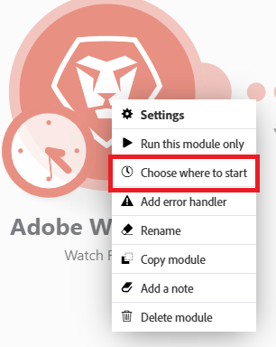

# Choisir l’emplacement de démarrage d’un module déclencheur

Certains modules déclencheur vous permettent de sélectionner le premier lot à partir duquel vous souhaitez que la récupération des lots démarre.

Vous pouvez également indiquer si vous souhaitez récupérer tous les lots ou uniquement les lots à partir d’une date spécifique.

Pour plus d’informations sur les modules de déclenchement, consultez la section [Modules de déclenchement](/help/workfront-fusion/get-started-with-fusion/understand-fusion/module-overview.md#trigger-modules) dans l’article Présentation des modules.

## Conditions d’accès

+++ Développez pour afficher les exigences d’accès aux fonctionnalités de cet article.

Vous devez disposer des accès suivants pour utiliser les fonctionnalités de cet article :

<table style="table-layout:auto">
 <col> 
 <col> 
 <tbody> 
  <tr> 
   <td role="rowheader">[!DNL Adobe Workfront] paquet</td> 
   <td> 
Tous
 </td> 
  </tr> 
  <tr data-mc-conditions=""> 
   <td role="rowheader">[!DNL Adobe Workfront] licence</td> 
   <td> 
Nouveau : [!UICONTROL Standard]

Ou

En cours : [!UICONTROL Work] ou supérieur
 </td> 
  </tr> 
  <tr> 
   <td role="rowheader">[!DNL Adobe Workfront Fusion] licence**</td> 
   <td>
   
Actuelle : aucune exigence de licence [!DNL Workfront Fusion] requise.

   
Ou

   
Héritée : n’importe laquelle. 

   </td> 
  </tr> 
  <tr> 
   <td role="rowheader">Produit</td> 
   <td>
   
Nouveau :
 <ul><li>[!UICONTROL Select] ou [!UICONTROL Prime] plan de [!DNL Workfront] : votre entreprise doit acheter des [!DNL Adobe Workfront Fusion].</li><li>[!UICONTROL Ultimate] [!DNL Workfront] plan : [!DNL Workfront Fusion] est inclus.</li></ul>
   
Ou

   
Actuel : votre entreprise doit acheter [!DNL Adobe Workfront Fusion].

   </td> 
  </tr>
 </tbody> 
</table>

Pour plus d’informations sur les informations contenues dans ce tableau, voir [Conditions d’accès requises dans la documentation](/help/workfront-fusion/references/licenses-and-roles/access-level-requirements-in-documentation.md).

Pour plus d’informations sur les licences [!DNL Adobe Workfront Fusion], voir Licences [[!DNL Adobe Workfront Fusion] ](/help/workfront-fusion/set-up-and-manage-workfront-fusion/licensing-operations-overview/license-automation-vs-integration.md).

+++

## Choisir l’emplacement de démarrage d’un module déclencheur

1. Cliquez sur l’onglet **[!UICONTROL Scenarios]** dans le panneau de gauche.
1. Sélectionnez le scénario dans lequel vous souhaitez choisir l’emplacement de départ du déclencheur.
1. Cliquez n’importe où sur le scénario pour accéder à l’éditeur de scénarios.
1. Configurez et enregistrez un module de déclenchement.

   Ou

   Cliquez avec le bouton droit de la souris sur l’icône du module de déclenchement, puis sélectionnez **Choisir par où commencer**.

   

1. Sélectionnez une option dans la zone de **[!UICONTROL Choose where to start]** qui s’affiche.

   Les options affichées dépendent des possibilités d’un service donné. Elles peuvent inclure les éléments suivants :

   <table style="table-layout:auto">
    <col> 
    <col> 
    <tbody>
    <tr>
    <td>[!UICONTROL From now on] (par défaut)</td>
    <td>Récupère tous les lots ajoutés ou mis à jour (en fonction des paramètres) une fois cette option sélectionnée</td>
    </tr>
     <tr>
    <td>[!UICONTROL Since specific date]</td>
    <td>Récupère tous les lots ajoutés ou mis à jour (en fonction des paramètres) après une date et une heure spécifiées</td>
      </tr>
      <tr>
    <td>[!UICONTROL All]</td>
    <td>Récupère tous les lots disponibles</td>
     </tr>
      <tr>
    <td>[!UICONTROL Choose manually]</td>
    <td>Permet de sélectionner le premier lot à partir duquel la récupération des lots doit démarrer.</td>
     </tr>
     </tbody>
   </table>

   <table style="table-layout:auto">
    <col> 
    <col> 
    <tbody> 
     <tr> 
      <td role="rowheader"> 
[!UICONTROL Connection name]
 </td> 
      <td>Saisir un nom pour la nouvelle connexion [!DNL DocuSign]</td> 
     </tr> 
     <tr> 
      <td role="rowheader">[!UICONTROL Account type]</td> 
      <td>Indiquez si le compte auquel vous souhaitez vous connecter est un compte de production ou de démonstration.</td> 
     </tr> 
    </tbody> 
   </table>

