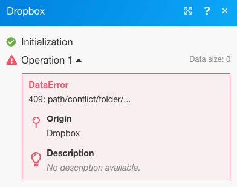

# Ajouter le filtrage et l’imbrication aux itinéraires de gestion des erreurs

Vous pouvez ajouter des techniques avancées de gestion des erreurs à votre itinéraire de gestion des erreurs en incluant le filtrage et l’imbrication.

## Conditions d’accès

+++ Développez pour afficher les exigences d’accès aux fonctionnalités de cet article.

<table style="table-layout:auto">
 <col> 
 <col> 
 <tbody> 
  <tr> 
   <td role="rowheader">Package Adobe Workfront</td> 
   <td> 
Tout package de workflow Adobe Workfront et tout package d’automatisation et d’intégration Adobe Workfront

Workfront Ultimate

les packages Workfront Prime et Select, avec un achat supplémentaire de Workfront Fusion.
 </td> 
  </tr> 
  <tr data-mc-conditions=""> 
   <td role="rowheader">Licences Adobe Workfront</td> 
   <td> 
Standard

Travail ou supérieur
 </td> 
  </tr> 
  <tr> 
   <td role="rowheader">Produit</td> 
   <td>
   
Si votre entreprise dispose d’un package Select ou Prime Workfront qui n’inclut pas l’automatisation et l’intégration de Workfront, elle doit acheter Adobe Workfront Fusion.</li></ul>
   </td> 
  </tr>
 </tbody> 
</table>

Pour plus d’informations sur les informations contenues dans ce tableau, voir [Conditions d’accès requises dans la documentation](/help/workfront-fusion/references/licenses-and-roles/access-level-requirements-in-documentation.md).

+++

## Filtrage

Deux types de filtrage peuvent être effectués sur un itinéraire de traitement des erreurs.

* [Ajouter un filtre à l’itinéraire du gestionnaire d’erreurs](#add-a-filter-to-the-error-handler-route)
* [Ajoutez un routeur suivi de filtres à l’itinéraire du gestionnaire d’erreurs](#add-a-router-followed-by-filters-to-the-error-handler)

### Ajouter un filtre à l’itinéraire du gestionnaire d’erreurs

Vous pouvez utiliser un filtre pour contrôler les erreurs qui sont traitées par l’itinéraire du gestionnaire d’erreurs. Cela vous permet de ne traiter que certains types d’erreur. Si une erreur ne passe pas le filtre, elle sera traitée comme s’il n’y avait pas d’itinéraire de gestionnaire d’erreurs défini pour le module donné.

Ces filtres sont configurés comme tout autre filtre dans Fusion. Pour obtenir des instructions, voir [Ajouter un filtre à un scénario](/help/workfront-fusion/create-scenarios/add-modules/add-a-filter-to-a-scenario.md).

### Ajoutez un routeur suivi de filtres au gestionnaire d’erreurs

L’ajout d’un routeur à un itinéraire de gestion des erreurs vous permet de configurer différents itinéraires pour différents types d’erreurs.

Par exemple, pour configurer un itinéraire à exécuter lorsque l’erreur est une DataError, vous pouvez configurer un filtre qui permet aux données de passer si le type d’erreur mappé est égal à DataError.

Pour plus d’informations sur la manière dont Fusion évalue et traite divers types de données, voir [Types d’erreur](/help/workfront-fusion/references/errors/error-processing.md).

### Exemple : gestion des erreurs avec des filtres

>[!BEGINSHADEBOX]

Cet exemple de scénario montre comment ces filtres fonctionnent pour la gestion des erreurs.

Si vous utilisez le module Dropbox > Create a folder alors qu’un dossier portant le même nom existe déjà, le module renvoie une erreur DataError :

Le scénario complet fonctionne comme suit :

1. Le module Outils > Définir la variable contient le nom du dossier
1. Le module HTTP > Get a file récupère le fichier qui doit être téléchargé dans le dossier
1. Le module Dropbox > Create a folder (Créer un dossier) renvoie une erreur si un dossier portant le même nom que celui mappé dans le module existe déjà
1. L&#39;itinéraire du gestionnaire d&#39;erreurs (bulles transparentes) contient un routeur pour filtrer les erreurs
La première route correspond à un type d’erreur spécifié appelé `DataError`.

   1. Si une `DataError` a lieu et que les détails de l’erreur passent par le filtre, le module Dropbox > Lister tous les fichiers/sous-dossiers dans un dossier répertorie tous les dossiers dans Dropbox.
   1. Le filtre suivant correspond aux noms de dossier.
   1. La directive **Resume** spécifie l’ID de dossier et le chemin d’accès au dossier existant. L’exécution du scénario reprend à partir du module Dropbox > Création d’un dossier . Cependant, au lieu de créer un dossier, Fusion utilise les valeurs de la directive Resume pour passer au module suivant et charger le fichier dans le dossier existant.

1. La deuxième route est utilisée pour toutes les autres erreurs et se termine par la directive Rollback, qui entraîne l&#39;arrêt immédiat du scénario

Vous trouverez ci-dessous une explication détaillée de l’itinéraire DataError.

Pour utiliser le dossier existant dans vos modules suivants, tel que Charger un fichier, vous devez ajouter un itinéraire de gestionnaire d’erreurs au module et récupérer le chemin du dossier à mapper dans le module de directive de reprise qui suit :

Le filtre sur le premier itinéraire est défini pour gérer uniquement l’erreur particulière (DataError) qui apparaît lorsqu’un dossier portant le même nom existe déjà :

Le module Dropbox > Répertorier tous les fichiers d’un dossier est configuré pour renvoyer tous les dossiers du dossier cible. Le filtre suivant ne transmet que celui que nous tentions de créer à l’origine. (Le nom du dossier est stocké dans le 33. Élément du nom du dossier.)

La directive Resume fournit ensuite le chemin d’accès Folder comme sortie pour le module en échec. Notez que l’ID de dossier a été laissé vide, car il n’est pas nécessaire pour le module Charger un fichier .

>[!ENDSHADEBOX]

## Imbriquer

Les itinéraires des gestionnaires d&#39;erreurs peuvent être créés et configurés sur tous les modules, sauf les routeurs. Par conséquent, vous pouvez créer un itinéraire de gestionnaire d’erreurs pour un module qui fait déjà partie d’un itinéraire de gestionnaire d’erreurs existant.

>[!BEGINSHADEBOX]

Exemple :

Un itinéraire de gestionnaire d’erreurs imbriqué avec des filtres :

Dans ce scénario, le deuxième itinéraire de gestionnaire d’erreurs est imbriqué sous le premier itinéraire de gestionnaire d’erreurs.

Si le module Dropbox > Create a folder rencontre une erreur, l’exécution passe à la première route. Si le filtre `DataError Takes Place` est transmis, le module suivant s’exécute, suivi du module de directive Resume si aucune erreur ne se produit dans Dropbox > Lister tous les fichiers/sous-dossiers d’un module de dossier.

Cependant, si une erreur se produit dans Dropbox > Répertorier tous les fichiers/sous-dossiers dans un module de dossier, l’exécution se déplace vers l’Itinéraire 2 du gestionnaire d’erreurs et se termine par la directive [!UICONTROL Ignorer]. Le module [!UICONTROL Reprendre la directive] n’est pas exécuté dans ce cas.

>[!ENDSHADEBOX]
