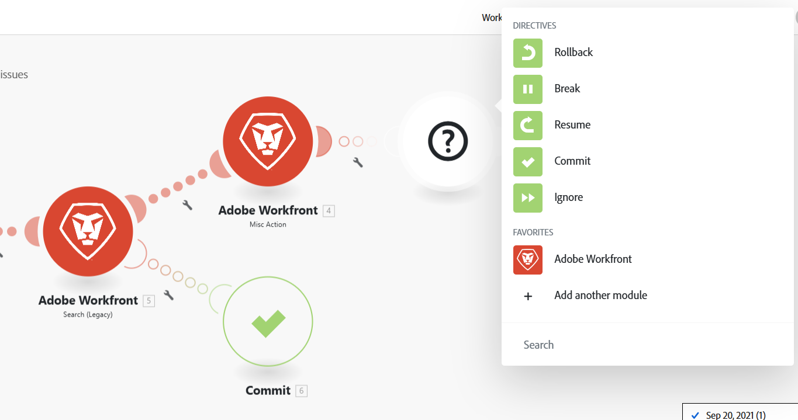

# Ajouter la gestion des erreurs

Des erreurs peuvent se produire lors de l’exécution d’un scénario.

Par exemple, une erreur peut se produire pour les raisons suivantes :

* Un service n’est pas disponible en raison d’un échec.
* Un service répond avec des données inattendues
* Échec de la validation des données d’entrée
* Autres raisons

Si un module rencontre une erreur lors de l’exécution du scénario et qu’aucun itinéraire de gestion des erreurs n’est associé au module, la logique de gestion des erreurs par défaut s’exécute.

En ajoutant un itinéraire du gestionnaire des erreurs à un module, vous pouvez remplacer la logique de gestion des erreurs par défaut par la vôtre. Adobe Workfront Fusion propose cinq directives différentes qui peuvent être insérées à la fin de vos itinéraires de gestionnaire d’erreurs.

Pour plus d’informations sur la gestion des erreurs par défaut, voir [Types d’erreur](/help/workfront-fusion/references/errors/error-processing.md).

Pour plus d’informations sur les directives de gestion des erreurs, voir [Directives de gestion des erreurs](/help/workfront-fusion/references/errors/directives-for-error-handling.md).

## Conditions d’accès

+++ Développez pour afficher les exigences d’accès aux fonctionnalités de cet article.

<table style="table-layout:auto">
 <col> 
 <col> 
 <tbody> 
  <tr> 
   <td role="rowheader">Package Adobe Workfront</td> 
   <td> 
Tout package de workflow Adobe Workfront et tout package d’automatisation et d’intégration Adobe Workfront

Workfront Ultimate

les packages Workfront Prime et Select, avec un achat supplémentaire de Workfront Fusion.
 </td> 
  </tr> 
  <tr data-mc-conditions=""> 
   <td role="rowheader">Licences Adobe Workfront</td> 
   <td> 
Standard

Travail ou supérieur
 </td> 
  </tr> 
  <tr> 
   <td role="rowheader">Produit</td> 
   <td>
   
Si votre entreprise dispose d’un package Select ou Prime Workfront qui n’inclut pas l’automatisation et l’intégration de Workfront, elle doit acheter Adobe Workfront Fusion.</li></ul>
   </td> 
  </tr>
 </tbody> 
</table>

Pour plus d’informations sur les informations contenues dans ce tableau, voir [Conditions d’accès requises dans la documentation](/help/workfront-fusion/references/licenses-and-roles/access-level-requirements-in-documentation.md).

+++

## Ajouter un gestionnaire d’erreurs

Pour ajouter un gestionnaire d’erreurs à un module :

1. Cliquez sur l’onglet **[!UICONTROL Scénarios]** dans le panneau de gauche.
1. Sélectionnez le scénario dans lequel vous souhaitez ajouter un itinéraire de gestion des erreurs.
1. Cliquez n’importe où sur le scénario pour accéder à l’éditeur de scénarios.
1. Cliquez avec le bouton droit sur le module après lequel vous souhaitez ajouter un itinéraire de gestionnaire d’erreurs, puis sélectionnez **[!UICONTROL Ajouter un gestionnaire d’erreurs]** :

   

   Un itinéraire de gestionnaire d’erreurs est ajouté au module . Si le module est le dernier module dans un itinéraire, le gestionnaire d’erreurs suit directement le module. Si le module comporte d’autres modules par la suite, un itinéraire de gestionnaire d’erreurs distinct est ajouté.

   Le module de gestion des erreurs affiche une liste des directives ainsi que des applications utilisées dans votre scénario.

   

1. Sélectionnez l’une des directives.

   Ou

   Ajoutez un ou plusieurs modules à l’itinéraire du gestionnaire d’erreurs.

   Si vous ajoutez d’autres modules à l’itinéraire, la directive Ignorer est appliquée par défaut. En cas d’erreur, les modules suivants de cet itinéraire sont traités.

   Pour plus d’informations sur les directives, voir [Gestion des erreurs liées aux directives](#error-handling-directives) dans cet article.

1. (Facultatif) Ajoutez un filtre à l’itinéraire de gestion des erreurs. Pour obtenir des instructions, voir [Ajouter le filtrage et l’imbrication aux itinéraires de gestion des erreurs](/help/workfront-fusion/create-scenarios/config-error-handling/advanced-error-handling.md).

>[!NOTE]
>
>Notez qu’un itinéraire du gestionnaire des erreurs est composé de cercles transparents, tandis qu’un itinéraire normal est composé de cercles pleins.

## Directives de gestion des erreurs

Les directives sont brièvement expliquées ci-dessous. Pour plus d’informations, voir [Directives relatives au traitement des erreurs](/help/workfront-fusion/references/errors/directives-for-error-handling.md).

Il existe cinq directives, qui peuvent être regroupées dans les catégories suivantes selon que l’exécution d’un scénario se poursuit ou non après l’erreur.

Les directives suivantes garantissent la poursuite de l’exécution d’un scénario :

* **[!UICONTROL Reprendre]** : permet de spécifier une sortie de substitution pour le module avec l’erreur. Le statut d’exécution du scénario est marqué comme réussi.
* **[!UICONTROL Ignorer]** : ignore l’erreur. Le statut d’exécution du scénario est marqué comme réussi.
* **[!UICONTROL Interrompre]** : enregistre l’entrée dans la file d’attente des exécutions incomplètes. Le statut d’exécution du scénario est marqué comme avertissement.

  Pour plus d’informations, voir [Affichage et résolution des exécutions incomplètes](/help/workfront-fusion/manage-scenarios/view-and-resolve-incomplete-executions.md).

Si l’exécution d’un scénario doit s’arrêter en cas d’erreur, utilisez l’une des directives suivantes :

* **[!UICONTROL Restaurer]** : arrête immédiatement l’exécution du scénario et marque son statut comme erreur.
* **[!UICONTROL Validation]** : arrête immédiatement l’exécution du scénario et marque son statut comme réussi.

## Ressources

Pour plus d’informations sur la gestion des erreurs, consultez ce qui suit :

* [Directives pour la gestion des erreurs dans Adobe Workfront Fusion](/help/workfront-fusion/references/errors/directives-for-error-handling.md)
* [Ajouter le filtrage et l’imbrication aux itinéraires de gestion des erreurs](/help/workfront-fusion/create-scenarios/config-error-handling/advanced-error-handling.md)
