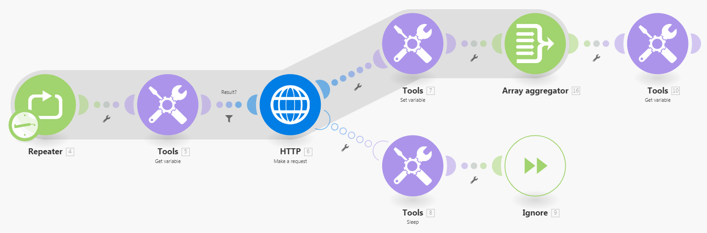

# Configurer `retry` solution de contournement de la gestion des erreurs

Parfois, il est utile de réexécuter un module en échec s’il existe une chance que la raison de l’échec puisse se résoudre rapidement.

Adobe Workfront Fusion n’offre actuellement pas la directive de gestion des erreurs `retry`, mais deux solutions sont disponibles pour imiter la fonctionnalité de `retry`.

## Conditions d’accès

+++ Développez pour afficher les exigences d’accès aux fonctionnalités de cet article.

<table style="table-layout:auto">
 <col> 
 <col> 
 <tbody> 
  <tr> 
   <td role="rowheader">Package Adobe Workfront</td> 
   <td> 
Tout package de workflow Adobe Workfront et tout package d’automatisation et d’intégration Adobe Workfront

Workfront Ultimate

les packages Workfront Prime et Select, avec un achat supplémentaire de Workfront Fusion.
 </td> 
  </tr> 
  <tr data-mc-conditions=""> 
   <td role="rowheader">Licences Adobe Workfront</td> 
   <td> 
Standard

Travail ou supérieur
 </td> 
  </tr> 
  <tr> 
   <td role="rowheader">Produit</td> 
   <td>
   
Si votre entreprise dispose d’un package Select ou Prime Workfront qui n’inclut pas l’automatisation et l’intégration de Workfront, elle doit acheter Adobe Workfront Fusion.</li></ul>
   </td> 
  </tr>
 </tbody> 
</table>

Pour plus d’informations sur les informations contenues dans ce tableau, voir [Conditions d’accès requises dans la documentation](/help/workfront-fusion/references/licenses-and-roles/access-level-requirements-in-documentation.md).

+++

## Solutions de contournement à la directive de gestion des erreurs de [!UICONTROL reprise]

Workfront Fusion ne propose actuellement pas la directive de gestion des erreurs `retry`. Utilisez l’une des solutions suivantes pour imiter la fonctionnalité de reprise.

Pour obtenir des instructions, voir [Directives relatives à la gestion des erreurs](/help/workfront-fusion/references/errors/directives-for-error-handling.md).

* [Utiliser la directive Break](#use-the-break-directive)
* [Utilisation du module Répéteur](#use-the-repeater-module)

### Utiliser la directive Break

Lorsque la directive Break s&#39;exécute, l&#39;état de l&#39;exécution du scénario est stocké dans la file d&#39;attente des exécutions incomplètes. Si cela se produit, vous pouvez ensuite résoudre manuellement l’exécution incomplète.

Pour obtenir des instructions, voir [Résoudre les erreurs gérées par la directive Break](/help/workfront-fusion/create-scenarios/config-error-handling/resolve-error-from-break-directive.md)

Pour obtenir des instructions sur la résolution des exécutions incomplètes, voir [Afficher et résoudre les exécutions incomplètes](/help/workfront-fusion/manage-scenarios/view-and-resolve-incomplete-executions.md).

#### Inconvénients

* L’intervalle de reprise minimal est d’une minute.
* Si le module traite plusieurs lots et que le traitement d’un lot échoue, l’exécution partielle (uniquement le lot à l’origine de l’erreur) est déplacée vers le dossier des exécutions incomplètes et planifiée pour les reprises, conformément aux paramètres de la directive [!UICONTROL Interrompre]. Cependant, l’exécution en cours se poursuit et le module continue de traiter les lots suivants.

  Pour empêcher le scénario de s’exécuter à nouveau jusqu’à ce que l’exécution stockée dans le dossier Exécutions incomplètes ait été résolue, activez l’option « [!UICONTROL  Traitement séquentiel ] » dans les [!UICONTROL  paramètres du scénario].

Pour plus d’informations sur les exécutions incomplètes, voir [Afficher et résoudre les exécutions incomplètes](/help/workfront-fusion/manage-scenarios/view-and-resolve-incomplete-executions.md).

### Utilisation du module Répéteur

La solution de contournement du module Répéteur est plus complexe, mais plus personnalisable.

#### Configurer l’itinéraire du gestionnaire d’erreurs

1. Cliquez sur l’onglet **[!UICONTROL Scénarios]** dans le panneau de gauche.
1. Sélectionnez le scénario dans lequel vous souhaitez ajouter la solution de contournement.
1. Cliquez n’importe où sur le scénario pour accéder à l’éditeur de scénarios.
1. Cliquez sur l’icône **Contrôle de flux**  et sélectionnez **Répéteur**.
1. Dans le module Répéteur, définissez le champ **[!UICONTROL Répétitions]** sur le nombre maximal de fois où vous souhaitez que le scénario réessaye.
1. Connectez le module potentiellement défaillant après le module **[!UICONTROL Répéteur]**.
1. Joignez un itinéraire de gestionnaire d’erreurs au module potentiellement en échec.

   Pour obtenir des instructions, voir [Ajouter la gestion des erreurs](/help/workfront-fusion/create-scenarios/config-error-handling/error-handling.md).
1. Ajoutez le module **[!UICONTROL Outils] > [!UICONTROL Veille]** à l’itinéraire du gestionnaire d’erreurs et définissez son champ **[!UICONTROL Délai]** sur le nombre de secondes entre les nouvelles tentatives.

1. Ajoutez la directive **[!UICONTROL Ignorer]** après le module **[!UICONTROL Outils] > [!UICONTROL Veille]**.
1. Passez à [Configurer l’itinéraire par défaut](#configure-the-default-route).

#### Configurer l’itinéraire par défaut

1. Ajoutez le module **[!UICONTROL Outils] > [!UICONTROL Définir la variable]** dans un itinéraire distinct (gestionnaire de non-erreur) après le module potentiellement en échec et configurez-le pour stocker le résultat du module dans une variable nommée, telle que `Result`.

1. Ajoutez le module **[!UICONTROL Agrégateur de tableaux]** après le module **[!UICONTROL Outils] > [!UICONTROL Définir la variable]** et sélectionnez le module **[!DNL Repeater]** dans son champ Module Source .

1. Ajoutez le module **[!UICONTROL Tools] > [!UICONTROL Get variable]** après le module **[!UICONTROL Array aggregator]** et mappez-lui la valeur de la variable `Result`.

1. Insérez le module **[!UICONTROL Outils] > [!UICONTROL Obtenir la variable]** entre le module **[!UICONTROL Répéteur]** et le module potentiellement défaillant, puis mappez-lui la valeur de la variable `Result`.

1. Insérez un filtre entre le module **[!UICONTROL Outils] > [!UICONTROL Obtenir une variable]** et le module potentiellement défaillant pour ne continuer que si la variable `Result` n’existe pas.

>[!BEGINSHADEBOX]

**Exemple :**

Dans cet exemple de scénario, le module [!UICONTROL HTTP] > [!UICONTROL Effectuer une requête] représente le module potentiellement en échec :

>[!ENDSHADEBOX]

Si le résultat du module potentiellement défaillant est trop complexe pour être stocké dans une variable simple, vous pouvez utiliser un magasin de données pour stocker et récupérer le résultat. Le magasin de données ne contiendrait qu’un seul enregistrement. La clé de l’enregistrement peut être, par exemple, `Result`.

Pour plus d’informations sur les magasins de données, voir [Magasins de données](/help/workfront-fusion/create-scenarios/map-data/data-stores.md).

#### Inconvénients

* Cette solution de contournement est plus complexe.
* Cette solution utilise davantage d’opérations.

## Ressources

* Pour plus d&#39;informations sur les modules Répéteur et les directives d&#39;interruption, voir [Contrôle de flux](/help/workfront-fusion/references/apps-and-modules/tools-and-transformers/flow-control.md).
* Pour plus d’informations sur les modules Get Variable, voir [Outils](/help/workfront-fusion/references/apps-and-modules/tools-and-transformers/tools-modules.md).
