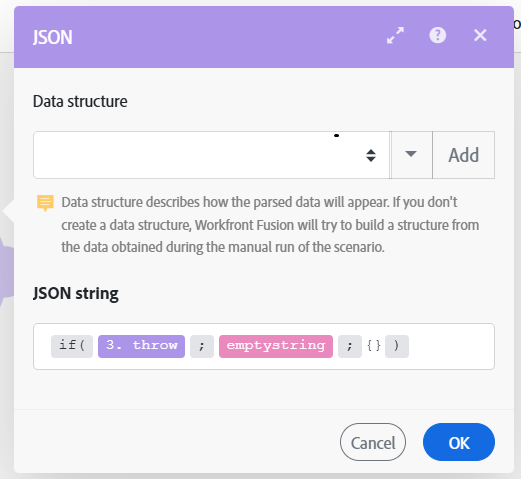

# Configurer `throw` solution de contournement d’erreur

Dans certains cas, vous pouvez vouloir arrêter de force l’exécution du scénario suivie de la phase de restauration ou de validation, ou arrêter le traitement d’un itinéraire et le stocker éventuellement dans la file d’attente des exécutions incomplètes.

Actuellement, les directives de gestion des erreurs ne peuvent pas être utilisées hors de portée d’un itinéraire de gestionnaire d’erreurs et Adobe Workfront Fusion ne propose pas de module qui vous permettrait de générer (lancer) facilement et de manière conditionnelle des erreurs.

Vous pouvez utiliser la solution suivante pour imiter la fonctionnalité d’erreur `throw`.

Pour plus d’informations sur les exécutions incomplètes, voir [Afficher et résoudre des exécutions incomplètes dans Adobe Workfront Fusion](/help/workfront-fusion/manage-scenarios/view-and-resolve-incomplete-executions.md).

Pour plus d’informations sur les directives de gestion des erreurs, voir [Directives relatives à la gestion des erreurs dans Adobe Workfront Fusion](/help/workfront-fusion/references/errors/directives-for-error-handling.md).

## Conditions d’accès

+++ Développez pour afficher les exigences d’accès aux fonctionnalités de cet article.

<table style="table-layout:auto">
 <col> 
 <col> 
 <tbody> 
  <tr> 
   <td role="rowheader">Package Adobe Workfront</td> 
   <td> 
Tout package de workflow Adobe Workfront et tout package d’automatisation et d’intégration Adobe Workfront

Workfront Ultimate

les packages Workfront Prime et Select, avec un achat supplémentaire de Workfront Fusion.
 </td> 
  </tr> 
  <tr data-mc-conditions=""> 
   <td role="rowheader">Licences Adobe Workfront</td> 
   <td> 
Standard

Travail ou supérieur
 </td> 
  </tr> 
  <tr> 
   <td role="rowheader">Produit</td> 
   <td>
   
Si votre entreprise dispose d’un package Select ou Prime Workfront qui n’inclut pas l’automatisation et l’intégration de Workfront, elle doit acheter Adobe Workfront Fusion.</li></ul>
   </td> 
  </tr>
 </tbody> 
</table>

Pour plus d’informations sur les informations contenues dans ce tableau, voir [Conditions d’accès requises dans la documentation](/help/workfront-fusion/references/licenses-and-roles/access-level-requirements-in-documentation.md).

+++

## Solution de contournement pour `throw`

Pour générer de manière conditionnelle une erreur, vous pouvez configurer un module pour qu’il échoue délibérément lors de son fonctionnement. Vous pouvez par exemple utiliser le module [!UICONTROL JSON] > [!UICONTROL Parse JSON], configuré pour générer éventuellement une erreur (`BundleValidationError` dans ce cas) :

Vous pouvez ensuite joindre l’une des directives de gestion des erreurs à l’itinéraire de gestion des erreurs :

* **Restaurer** : force l’arrêt de l’exécution du scénario et effectue la phase de restauration.
* **Validation** : force l’arrêt de l’exécution du scénario et effectue la phase de validation.
* **Ignorer** : permet d’arrêter le traitement d’un itinéraire.
* **Saut** : arrêtez le traitement d’un itinéraire et stockez-le dans le dossier des exécutions incomplètes de la file d’attente.

L’exemple suivant illustre l’utilisation de la directive [!DNL Rollback] :

