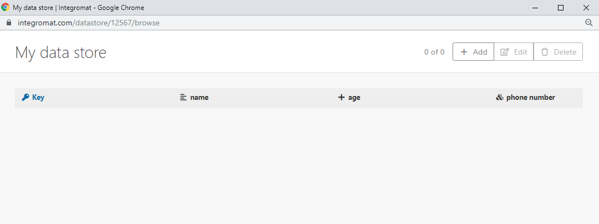

# Créer et gérer des magasins de données

Un entrepôt de données, comparable à une base de données ou à un simple tableau, peut conserver des informations de scénarios, facilitant ainsi le transfert de données entre divers scénarios ou exécutions de scénarios. Vous pouvez utiliser un magasin de données pour stocker de nouvelles données provenant de différents systèmes lors de la synchronisation.

Les modules d’entrepôt de données vous permettent d’effectuer les actions suivantes sur les enregistrements de votre entrepôt de données Adobe Workfront Fusion :

* Ajouter
* Remplacer
* Mettre à jour
* Récupérer
* Supprimer
* Recherche
* Nombre

Pour plus d’informations sur l’utilisation des modules de l’entrepôt de données, consultez les [[!UICONTROL modules Entrepôt de données]](/help/workfront-fusion/references/apps-and-modules/tools-and-transformers/data-store-modules.md).

Pour une vidéo de présentation des entrepôts de données dans Workfront Fusion, voir :

* [Entrepôts de données](https://video.tv.adobe.com/v/3427029/){target=_blank}

## Conditions d’accès

+++ Développez pour afficher les exigences d’accès aux fonctionnalités de cet article.

<table style="table-layout:auto">
 <col> 
 <col> 
 <tbody> 
  <tr> 
   <td role="rowheader">Package Adobe Workfront</td> 
   <td> 
Tout package de workflow Adobe Workfront et tout package d’automatisation et d’intégration Adobe Workfront

Workfront Ultimate

les packages Workfront Prime et Select, avec un achat supplémentaire de Workfront Fusion.
 </td> 
  </tr> 
  <tr data-mc-conditions=""> 
   <td role="rowheader">Licences Adobe Workfront</td> 
   <td> 
Standard

Travail ou supérieur
 </td> 
  </tr> 
  <tr> 
   <td role="rowheader">Produit</td> 
   <td>
   
Si votre entreprise dispose d’un package Select ou Prime Workfront qui n’inclut pas l’automatisation et l’intégration de Workfront, elle doit acheter Adobe Workfront Fusion.</li></ul>
   </td> 
  </tr>
 </tbody> 
</table>

Pour plus d’informations sur les informations contenues dans ce tableau, voir [Conditions d’accès requises dans la documentation](/help/workfront-fusion/references/licenses-and-roles/access-level-requirements-in-documentation.md).

+++

## Espace de données disponible

Si votre entreprise utilise le nouveau modèle de formules Workfront (packages Select, Prime et Ultimate), la formule de votre entreprise affecte la taille et le nombre d’entrepôts de données disponibles pour votre instance Fusion.

### Formule Ultimate

Les instances de fusion avec le package Ultimate reçoivent ce qui suit :

* 100 Mo d’espace
* 50 entrepôts de données

### Formules Select et Prime

Les instances Fusion sur les packages Select ou Prime reçoivent :-->

* 100 Mo pour les 500 000 premières opérations.

* 10 Mo pour chaque tranche de 100 000 opérations supplémentaires.

  Par exemple, une organisation avec 600 000 opérations reçoit 110 Mo.

Chaque équipe de votre entreprise peut avoir jusqu’à 50 entrepôts de données. La taille combinée de ces entrepôts de données ne peut pas dépasser la taille totale des entrepôts de données de votre organisation.

## Création d’un magasin de données dans Workfront Fusion

* [Configurer l’entrepôt de données](#set-up-the-data-store)
* [Configurer la structure de données](#set-up-the-data-structure)

### Configurer l’entrepôt de données

Avant de pouvoir utiliser un magasin de données dans un module, vous devez le créer dans Workfront Fusion.

>[!NOTE]
>
>Votre entreprise dispose d’un nombre limité d’entrepôts de données disponibles. Si vous tentez de créer plus de magasins de données que vous n’en avez disponibles, Workfront renvoie une erreur [!UICONTROL &#x200B; Le nombre maximum de magasins a atteint &#x200B;].
>
>Pour plus d’informations, consultez dans cet article la section [Erreur Maximum d’entrepôts atteint](#maximum-stores-reached-error).

1. Connectez-vous à votre compte Workfront Fusion.
1. Cliquez sur **[!UICONTROL Entrepôts de données]** dans le panneau de navigation de gauche.
1. Cliquez sur **[!UICONTROL Ajouter un entrepôt de données]** dans le coin supérieur droit de l’écran.
1. Saisissez les paramètres du nouvel entrepôt de données.

   Un titre en gras sur un champ d’un module Workfront Fusion indique un paramètre obligatoire.

   <table style="table-layout:auto">
    <col> 
    <col> 
    <tbody> 
     <tr> 
      <td>[!UICONTROL Data store name] </td> 
      <td> 
Saisissez un nom pour l’entrepôt de données. 
 </td> 
     </tr> 
     <tr> 
      <td> 
[!UICONTROL Data Structure]
 </td> 
      <td> 
Une structure de données est une liste des colonnes d’un tableau. Cette liste indique le nom de la colonne et le type de données.
 
Utilisez l’une des méthodes suivantes :
 
       <ul> 
        <li><b>Sélectionner une structure de données déjà créée</b></li> 
        <li><b>Ajouter une nouvelle structure de données</b> 
Cliquez sur <strong>[!UICONTROL Add]</strong> pour créer une structure de données.
 
Pour plus d’informations, consultez dans cet article la section <a href="#set-up-the-data-structure" class="MCXref xref">Configurer la structure de données</a>.
 </li> 
        <li style="font-weight: bold;"> 
Laisser le champ vide
 
Si vous ne sélectionnez pas ou n’ajoutez pas de structure de données, la base de données ne contiendra que la clé primaire. Ce type de base de données est utile si vous souhaitez enregistrer uniquement des clés et si vous ne voulez savoir que si une clé spécifique existe ou non dans la base de données.
 </li> 
       </ul> </td> 
     </tr> 
     <tr> 
      <td>Taille de stockage des données en Mo</td> 
      <td> 
Allouez la taille de l’entrepôt de données en fonction de la taille totale de votre entrepôt de données interne.
 
 La valeur par défaut est de 10 Mo. Si vous disposez de moins de 10 Mo d’espace de stockage de données non alloué à partir de votre allocation de 95 Mo, la taille par défaut correspond à la quantité de stockage non alloué.  
Note : le montant réservé peut être modifié à tout moment.
  </td> 
     </tr> 
    </tbody> 
   </table>

### Configurer la structure de données

1. Lors de la création ou de la modificationd’ un entrepôt de données, cliquez sur **[!UICONTROL Ajouter]**.
1. Dans la zone **[!UICONTROL Ajouter une structure de données]** qui s’affiche, configurez les champs suivants :

   <table style="table-layout:auto">
    <col> 
    <col> 
    <tbody> 
     <tr> 
      <td>[!UICONTROL Data structure name]</td> 
      <td> 
 Saisissez un nom pour la nouvelle structure de données.
 </td> 
     </tr> 
     <tr> 
      <td> 
[!UICONTROL Specification]
 </td> 
      <td> 
Pour configurer les colonnes de votre entrepôt de données, effectuez l’une des opérations suivantes :
 
       <ul> 
        <li> 
Cliquez sur <strong>[!UICONTROL Add item]</strong> pour spécifier manuellement les propriétés d’une colonne.
 
Saisissez le <strong>[!UICONTROL Name]</strong> et le <strong>[!UICONTROL Type]</strong> pour la colonne de l’entrepôt de données et définissez les propriétés correspondantes.
 </li> 
        <li> 
Cliquez sur <strong>[!UICONTROL Generator]</strong> pour déterminer les colonnes depuis les données d’exemple que vous fournissez.
 
         
Example: </b>">
          <b>Exemple :</b> 
          
Par exemple, les données d’exemple JSON suivantes créent trois colonnes : nom, âge et numéro de téléphone. Le numéro de téléphone est un ensemble de numéros de téléphone mobile et fixe.
 
          
<code>&lbrace;</code> 
 
          
<code>"name":"John",</code> 
 
          
<code>"age":30,</code> 
 
          
<code>"phone number": &lbrace;</code> 
 
          
<code>"mobile":"987654321",</code> 
 
          
<code>"landline":"123456789"</code> 
 
          
<code>&rbrace;</code> 
 
          
<code>&rbrace;</code> 
 
          
Colonnes vides dans la vue d’entrepôt de données :
 
          
  
 
          
Vous pouvez ajouter des valeurs à l’entrepôt de données manuellement ou à l’aide des modules d’entrepôt de données Workfront Fusion.
 
         
 </li> 
       </ul> </td> 
     </tr> 
     <tr> 
      <td>[!UICONTROL Strict] </td> 
      <td> 
Activez cette option pour vous assurer que le payload correspond aux structures de données. Les payloads qui contiennent des éléments supplémentaires non spécifiés dans la structure de données sont rejetées.
 </td> 
     </tr> 
    </tbody> 
   </table>

## Modifier un magasin de données existant

Vous pouvez modifier les propriétés et le contenu d’un magasin de données existant dans la zone [!UICONTROL Magasins de données] de Workfront Fusion.

* [Modifier les propriétés d’un magasin de données](#edit-the-properties-of-a-data-store)
* [Modifier le contenu d’un magasin de données](#edit-the-contents-of-a-data-store)

### Modifier les propriétés d’un magasin de données

Les propriétés d’un magasin de données incluent la structure de données utilisée par le magasin de données, ainsi que la taille du magasin de données.

1. Cliquez sur **[!UICONTROL Entrepôts de données]**  dans le panneau de navigation de gauche pour ouvrir la zone [!UICONTROL Entrepôts de données].
1. Cliquez sur **[!UICONTROL Modifier]**  en regard du magasin de données à modifier.
1. (Facultatif) Si vous souhaitez remplacer la structure de données utilisée par ce magasin de données par une autre structure de données existante, sélectionnez-la dans le menu déroulant **[!UICONTROL Structure des données]**.

   Ou

   (Facultatif) Si vous souhaitez modifier la structure de données utilisée par ce magasin de données en une structure de données entièrement nouvelle, consultez dans cet article la section [Configurer la structure des données](#set-up-the-data-structure).

1. (Facultatif) Modifiez la taille du magasin de données en saisissant la nouvelle taille dans le champ **[!UICONTROL Taille de stockage des données en Mo]**.
1. Cliquer sur **[!UICONTROL Enregistrer]**.

### Modifier le contenu d’un magasin de données

1. Cliquez sur l’icône **[!UICONTROL Entrepôt de données]**  dans le panneau de navigation de gauche pour ouvrir la zone [!UICONTROL Entrepôt de données].
1. Cliquez sur **[!UICONTROL Parcourir]** à côté du magasin de données que vous souhaitez modifier.
1. (Facultatif) Réorganisez les colonnes en les faisant glisser à l’emplacement souhaité.
1. (Facultatif) [!UICONTROL Modifiez] une seule cellule en cliquant sur l’icône **[!UICONTROL Modifier]** dans cette cellule, puis saisissez la valeur souhaitée.
1. (Facultatif) Ajoutez un nouvel élément au magasin de données en cliquant sur **[!UICONTROL Ajouter]**, puis saisissez les informations du nouvel élément.
1. Cliquer sur **[!UICONTROL Enregistrer]**.

## Dépannage

* [Restaurer des données perdues à partir d’un magasin de données](#restoring-lost-data-from-a-data-store)
* [Erreur d’espace insuffisant](#out-of-space-error)
* [Erreur de nombre maximum de magasins atteint](#maximum-stores-reached-error)

### Restaurer des données perdues à partir d’un magasin de données

Il n’existe actuellement aucun outil capable d’automatiser la restauration des données perdues.

#### Solution de contournement

1. Examinez tous les journaux d’exécution des scénarios dans lesquels des éléments ont été insérés dans le magasin de données.

   Pour plus d’informations sur l’examen des journaux d’exécution, voir [Afficher l’historique d’exécution d’un scénario](/help/workfront-fusion/manage-scenarios/view-scenario-execution-history.md).

1. Copiez les données.
1. Insérez à nouveau les données dans votre magasin de données.

   Pour plus d’informations sur l’insertion de données dans un magasin de données, consultez dans cet article la section [Modifier le contenu d’un magasin de données](#edit-the-contents-of-a-data-store).

### Erreur [!UICONTROL Espace insuffisant]

Une erreur [!UICONTROL Espace insuffisant] s’affiche, car les magasins de données que vous avez créés précédemment ont déjà été attribués à votre stockage de données alloué.

#### Solution de contournement

1. Modifiez l’un de vos magasins de données existants pour utiliser moins d’espace. De l’espace est ainsi libéré pour votre nouveau magasin de données.

   Pour plus d’informations, consultez dans cet article la section [Modifier les propriétés d’un magasin de données](#edit-the-properties-of-a-data-store) .

>[!NOTE]
>
>Nous vous recommandons de ne pas affecter tout votre espace à un seul magasin de données, sauf si vous avez la certitude que vous n’aurez pas besoin d’autres magasins de données.

### Erreur [!UICONTROL Nombre maximum de magasins atteint]

Une erreur [!UICONTROL Nombre maximal de magasins atteint] se produit, car votre organisation a utilisé tous ses magasins de données disponibles.

#### Solution de contournement

Pour réduire le nombre de magasins de données existants, envisagez d’effectuer l’une des opérations suivantes :

* Combiner des magasins de données existants
* Supprimer des magasins de données inutilisés
