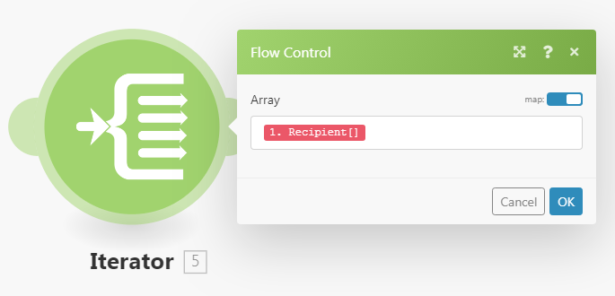

# Mapper un tableau ou un élément de tableau

Un tableau est un élément de lot qui peut contenir les éléments suivants :

* Une ou plusieurs valeurs du même type (tableau simple)
* Une ou plusieurs collections du même type (tableau complexe)

>[!BEGINSHADEBOX]

**Exemple :**

* **Tableau complexe** : le module [!UICONTROL Observer les e-mails] renvoie un tableau des pièces jointes pour chaque e-mail. Chaque pièce jointe représente une collection pouvant contenir un nom, un contenu, une taille, etc.

>[!ENDSHADEBOX]

## Conditions d’accès

+++ Développez pour afficher les exigences d’accès aux fonctionnalités de cet article.

Vous devez disposer des accès suivants pour utiliser les fonctionnalités de cet article :

<table style="table-layout:auto">
 <col> 
 <col> 
 <tbody> 
  <tr> 
   <td role="rowheader">Package Adobe Workfront</td> 
   <td> 
Tous
 </td> 
  </tr> 
  <tr data-mc-conditions=""> 
   <td role="rowheader">Licence Adobe Workfront</td> 
   <td> 
Nouveau : Standard

Ou

Actuelle : [!UICONTROL Work] ou niveau supérieur
 </td> 
  </tr> 
  <tr> 
   <td role="rowheader">Licence Adobe Workfront Fusion **</td> 
   <td>
   
Actuel : aucune exigence de licence Workfront Fusion.

   
Ou

   
Héritée : n’importe laquelle. 

   </td> 
  </tr> 
  <tr> 
   <td role="rowheader">Produit</td> 
   <td>
   
Nouveau :
 <ul><li>Plan Workfront [!UICONTROL Select] ou [!UICONTROL Prime] : votre entreprise doit acheter Adobe Workfront Fusion.</li><li>Plan Workfront [!UICONTROL Ultimate] : Workfront Fusion est inclus.</li></ul>
   
Ou

   
Actuel : votre entreprise doit acheter Adobe Workfront Fusion.

   </td> 
  </tr>
 </tbody> 
</table>

Pour plus d’informations sur les informations contenues dans ce tableau, voir [Conditions d’accès requises dans la documentation](/help/workfront-fusion/references/licenses-and-roles/access-level-requirements-in-documentation.md).

Pour plus d’informations sur les licences Adobe Workfront Fusion, voir [Licences Adobe Workfront Fusion](/help/workfront-fusion/set-up-and-manage-workfront-fusion/licensing-operations-overview/license-automation-vs-integration.md).

+++

## Mapper un tableau entier

1. Cliquez sur l’onglet **[!UICONTROL Scénarios]** dans le panneau de gauche.
1. Sélectionnez le scénario dans lequel vous souhaitez mapper un tableau.
1. Cliquez n’importe où sur le scénario pour accéder à l’éditeur de scénarios.
1. Dans le module auquel vous souhaitez mapper le tableau, cliquez sur le champ dans lequel vous souhaitez mapper le tableau. Il s’agit du champ auquel le tableau est mappé.

1. Dans la zone qui s’affiche, mappez l’élément.

   Le panneau vous permet de mapper les champs de la même manière qu’avec tout autre type d’élément. Si vous ne souhaitez pas remplir chaque élément séparément, mais que vous souhaitez mapper un autre tableau dans le champ cible, utilisez le bouton [!UICONTROL Mapper]. Dans ce cas, assurez-vous que les deux tableaux (le tableau source et le tableau cible) ont la même structure.

   Vous pouvez ajouter n’importe quel nombre d’éléments à un tableau.

Vous pouvez diviser un tableau en lots individuels à l’aide d’un itérateur. Pour plus d’informations, consultez la section [[!UICONTROL Module Itérateur] dans Adobe Workfront Fusion](/help/workfront-fusion/references/modules/iterator-module.md).

## Mapper des éléments dans un nouveau tableau

Certains champs de Workfront Fusion vous permettent de mapper des éléments dans un tableau. Par exemple, vous pouvez créer un tableau d’éléments de liste de contrôle dans le module Tableaux Workfront > Ajouter un élément de liste de contrôle . Lorsque le module est exécuté, tous les éléments de la liste de contrôle sont ajoutés à la carte.

Tout champ de module qui affiche « Ajouter un élément » crée un tableau.

Pour ajouter des éléments au tableau :

1. Cliquez sur **Ajouter un élément**
1. Dans le panneau qui s’ouvre, saisissez les détails de l’élément.
1. Cliquez sur **Ajouter**.
1. (Facultatif) Répétez les étapes 1 à 3 pour chaque élément à ajouter au tableau .

## Mapper des éléments de tableau

### Mapper des éléments de tableau par nombre

Les éléments de tableau s’affichent sous la forme d’un nombre entre crochets après le nom du tableau. Vous pouvez mapper un élément individuel d’un tableau dans un champ à l’aide de ce numéro d’index.

>[!NOTE]
>
>L’indexation des tableaux dans Workfront Fusion commence à partir de 1.

Pour mapper un élément de tableau :

1. Cliquez sur le champ dans lequel vous souhaitez mapper l’élément.

   Le panneau de mappage s’ouvre.

1. Recherchez le tableau contenant l’élément que vous souhaitez mapper.
1. Cliquez sur la flèche de liste déroulante en regard du tableau.
1. Cliquez sur l’élément à mapper.

   L’élément est mappé avec l’index de 1. Cela mappe le premier élément du tableau .

1. Pour mapper un autre élément du tableau, cliquez sur le [1] et saisissez le numéro d’index de l’élément du tableau que vous souhaitez mapper.

   

### Mapper l’élément d’un tableau avec une clé donnée

Certains tableaux contiennent des collections avec des éléments clé-valeur tels que des métadonnées, des attributs, etc. Pour utiliser l’une de ces valeurs, vous pouvez rechercher un élément par sa valeur de clé donnée et obtenir la valeur correspondante à partir de l’élément de valeur. Il est recommandé d’utiliser une formule combinant les fonctions `map()` et `get()`.

>[!BEGINSHADEBOX]

L’exemple suivant illustre la sortie de l’application [!DNL Jira].

Cet exemple obtient un nom de fichier à partir d’un tableau de pièces jointes, pour la pièce jointe spécifique avec l’ID 10108.

Cet exemple génère la sortie suivante :

La formule peut être expliquée comme suit :

* `map`

   1. Le premier paramètre de la fonction `map()` est l’élément de tableau entier.
   1. Le deuxième paramètre est le nom brut de l’élément de valeur. Pour obtenir le nom brut, pointez sur l’élément dans le panneau de [!UICONTROL mapping] :

      

      >[!NOTE]
      >
      >Tous les paramètres respectent la casse. Même si dans cet exemple particulier, le libellé de l’élément diffère de son nom brut uniquement en majuscules, il est nécessaire d’utiliser le nom brut.

   1. Le troisième paramètre est le nom brut de l’élément de clé :

      

   1. Le quatrième paramètre est la valeur de clé donnée.

  Parce que la fonction `map()` renvoie un tableau (puisqu’il peut y avoir plus d’éléments avec la valeur de clé donnée), il est nécessaire d’appliquer la fonction `get()` pour obtenir son premier élément :

* `get`

   1. Le premier paramètre de la fonction `get()` est le résultat de la fonction `map()`.

   1. Le deuxième paramètre est l’index de l’élément . Dans cet exemple, l’index est `1`.

Cet exemple génère la sortie suivante :

>[!ENDSHADEBOX]

Pour plus d&#39;informations sur la fonction `map()`, voir [Fonctions de tableau](/help/workfront-fusion/references/mapping-panel/functions/array-functions.md).

Pour plus d&#39;informations sur la fonction `get()`, voir [Fonctions générales](/help/workfront-fusion/references/mapping-panel/functions/general-functions.md).

## Convertir des éléments de tableau en une série de lots

Les tableaux peuvent être convertis en une série de lots à l’aide du module [!UICONTROL Itérateur]. Pour plus d’informations, voir [[!UICONTROL Module Itérateur]](/help/workfront-fusion/references/modules/iterator-module.md).

