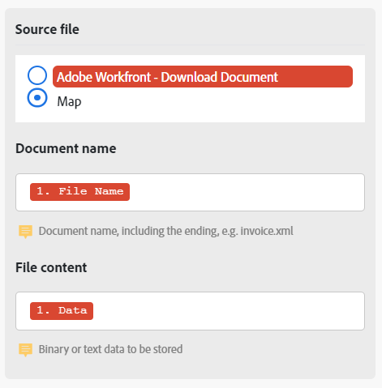

# Mappage d’un fichier entre des modules

Certains modules peuvent traiter des fichiers. Ces modules peuvent renvoyer un fichier de sortie à envoyer pour un traitement ultérieur ou exiger qu’un fichier leur soit transmis pour traitement. Les fichiers peuvent être mappés, de sorte qu’un fichier généré par un module puisse être traité par un autre.

## Conditions d’accès

+++ Développez pour afficher les exigences d’accès aux fonctionnalités de cet article.

Vous devez disposer des accès suivants pour utiliser les fonctionnalités de cet article :

<table style="table-layout:auto">
 <col> 
 <col> 
 <tbody> 
  <tr> 
   <td role="rowheader">[!DNL Adobe Workfront] paquet</td> 
   <td> 
Tous
 </td> 
  </tr> 
  <tr data-mc-conditions=""> 
   <td role="rowheader">[!DNL Adobe Workfront] licence</td> 
   <td> 
Nouveau : [!UICONTROL Standard]

Ou

En cours : [!UICONTROL Work] ou supérieur
 </td> 
  </tr> 
  <tr> 
   <td role="rowheader">[!DNL Adobe Workfront Fusion] licence**</td> 
   <td>
   
Actuelle : aucune exigence de licence [!DNL Workfront Fusion] requise.

   
Ou

   
Héritée : n’importe laquelle. 

   </td> 
  </tr> 
  <tr> 
   <td role="rowheader">Produit</td> 
   <td>
   
Nouveau :
 <ul><li>[!UICONTROL Select] ou [!UICONTROL Prime] plan de [!DNL Workfront] : votre entreprise doit acheter des [!DNL Adobe Workfront Fusion].</li><li>[!UICONTROL Ultimate] [!DNL Workfront] plan : [!DNL Workfront Fusion] est inclus.</li></ul>
   
Ou

   
Actuel : votre entreprise doit acheter [!DNL Adobe Workfront Fusion].

   </td> 
  </tr>
  <tr data-mc-conditions=""> 
   <td role="rowheader">Configurations du niveau d’accès*</td> 
   <td> 
     
Vous devez être un administrateur ou une administratrice [!DNL Workfront Fusion] de votre organisation.

     
Vous devez être un administrateur ou une administratrice [!DNL Workfront Fusion] de votre équipe.

   </td> 
  </tr> 
   </td> 
  </tr> 
 </tbody> 
</table>

Pour plus d’informations sur les informations contenues dans ce tableau, voir [Conditions d’accès requises dans la documentation](/help/workfront-fusion/references/licenses-and-roles/access-level-requirements-in-documentation.md).

Pour plus d’informations sur les licences [!DNL Adobe Workfront Fusion], voir Licences [[!DNL Adobe Workfront Fusion] ](/help/workfront-fusion/set-up-and-manage-workfront-fusion/licensing-operations-overview/license-automation-vs-integration.md).

+++

## Mappage de fichiers des modules sources vers les modules cibles

Les modules peuvent traiter des fichiers qui nécessitent deux informations :

* Nom du fichier
* Contenu du fichier (données)

Si des modules précédents génèrent un fichier, vous pouvez sélectionner le module source ; le nom et les données du fichier généré par ce module sont mappés au module cible.

Vous pouvez également saisir ce nom et ces données manuellement ou les mapper à partir des modules précédents. Cela peut s’avérer pratique lorsque vous renommez un fichier, par exemple.

>[!NOTE]
>
>Si vous devez traiter un fichier à partir d’une URL, nous vous recommandons d’utiliser le module `HTTP > Get a File` pour télécharger le fichier à partir de l’URL, puis de mapper le fichier du module `HTTP > Get a File` au champ du module souhaité dans votre scénario.
>
>

Pour mapper un fichier :

1. Cliquez sur l’onglet **[!UICONTROL Scenarios]** dans le panneau de gauche.
1. Sélectionnez le scénario dans lequel vous souhaitez mapper un fichier.
1. Cliquez n’importe où sur le scénario pour accéder à l’éditeur de scénarios.
1. Dans le module cible, qui est la cible que vous mappez, recherchez la zone **Fichier Source**.
1. Pour mapper un fichier généré par un module précédent, sélectionnez le module qui génère le fichier.

   

1. Pour mapper manuellement le nom et les données, sélectionnez Mapper, puis saisissez ou mappez le nom et les données du fichier.

   

1. Continuez à configurer le module ou cliquez sur **OK**.
