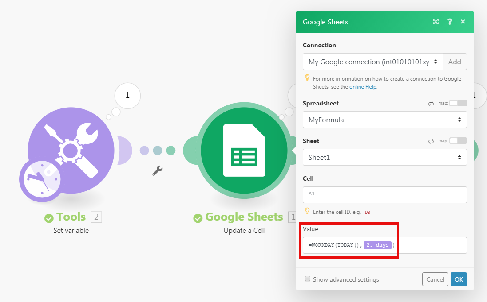

# Mappage d’un élément à l’aide de fonctions intégrées

Workfront Fusion inclut des fonctions intégrées qui vous permettent de créer des formules simples ou complexes. Ces fonctions couvrent un large éventail de cas d’utilisation, y compris les fonctions pour les tableaux, les chaînes, les nombres et les données des modules précédents.

En outre, vous pouvez créer des fonctions personnalisées que vos scénarios peuvent ensuite utiliser pour transformer et manipuler les données.

Pour plus d’informations et d’instructions sur les fonctions personnalisées, voir [Mappage de données à l’aide de fonctions personnalisées](/help/workfront-fusion/create-scenarios/map-data/map-using-custom-functions.md).

## Conditions d’accès

+++ Développez pour afficher les exigences d’accès aux fonctionnalités de cet article.

<table style="table-layout:auto">
 <col> 
 <col> 
 <tbody> 
  <tr> 
   <td role="rowheader">Package Adobe Workfront</td> 
   <td> 
Tout package de workflow Adobe Workfront et tout package d’automatisation et d’intégration Adobe Workfront

Workfront Ultimate

Packages Workfront Prime et Select, avec l’achat supplémentaire de Workfront Fusion.
 </td> 
  </tr> 
  <tr data-mc-conditions=""> 
   <td role="rowheader">Licences Adobe Workfront</td> 
   <td> 
Standard

Travail ou supérieur
 </td> 
  </tr> 
  <tr> 
   <td role="rowheader">Produit</td> 
   <td>
   
<ul><li>Si votre organisation dispose d’un package Workfront Select ou Prime qui n’inclut pas l’automatisation et l’intégration de Workfront, elle doit acquérir Adobe Workfront Fusion.</li><li>Vous devez disposer d’une licence Adobe App Builder pour utiliser des fonctions personnalisées.</ul>
   </td> 
  </tr>
 </tbody> 
</table>

Pour plus d’informations sur le contenu de ce tableau, consultez [Conditions d’accès requises dans la documentation](/help/workfront-fusion/references/licenses-and-roles/access-level-requirements-in-documentation.md).

+++

## Mappage de données à l’aide de fonctions intégrées

Lorsque vous mappez des éléments, vous pouvez utiliser des fonctions pour créer des formules simples ou complexes. Les fonctions disponibles sont similaires aux fonctions d’Excel et de certains langages de programmation :

* Elles évaluent la logique générale, les maths, le texte, les dates et les tableaux.
* Elles vous permettent d’effectuer une logique conditionnelle et des transformations des valeurs d’élément, comme convertir du texte en majuscules, rogner du texte, convertir une date dans un format différent, etc.

### Insérer des fonctions dans les champs

Pour insérer une fonction dans un champ, procédez comme suit :

1. Cliquez sur l’onglet **[!UICONTROL Scénarios]** dans le panneau de gauche.
1. Sélectionnez le scénario dans lequel vous souhaitez mapper les données.
1. Cliquez n’importe où sur le scénario pour accéder à l’éditeur de scénarios.
1. Cliquez sur le champ dans lequel vous souhaitez insérer une fonction.
1. Sélectionnez l’onglet dans le panneau de mappage qui contient la fonction que vous souhaitez insérer.

   Pour plus d’informations sur les onglets du panneau de mappage, voir [ Présentation des fonctions ](/help/workfront-fusion/get-started-with-fusion/understand-fusion/function-overview.md)
   1. Cliquez sur le nom de la fonction.

      Ou

      Faites glisser la fonction dans le champ.
1. Configurez les paramètres de la fonction .

   Pour obtenir une explication des paramètres de fonction, passez la souris sur la fonction dans le panneau de mappage.

   Pour plus d’informations sur les fonctions et leurs paramètres, consultez les articles sous [Références de fonction : index d’article](/help/workfront-fusion/references/mapping-panel/functions/functions-toc.md).

1. Continuez à configurer le module ou cliquez sur **OK**.

>[!TIP]
>
>Lorsque vous créez une formule complexe que vous souhaitez réutiliser dans un autre champ, vous pouvez cliquer sur le champ contenant la combinaison, utiliser Cmd-A ou Ctrl-A pour la sélectionner, puis la copier et la coller dans l&#39;autre champ.

>[!BEGINSHADEBOX]

**Exemple :** certains types de données empêchent les utilisateurs et utilisatrices de saisir plus d’un certain nombre de caractères. Vous pouvez utiliser la fonction substring pour limiter une valeur à un certain nombre de caractères.

Dans cet exemple, la fonction substring limite le nom du projet à 50 caractères.

>[!ENDSHADEBOX]

### Imbriquer des fonctions

Vous pouvez imbriquer des fonctions entre elles.

>[!BEGINSHADEBOX]

**Exemple :**

Dans cet exemple, la fonction sous-chaîne limite le nom du projet tronqué à 50 caractères.

>[!ENDSHADEBOX]

Pour imbriquer une fonction :

1. Cliquez sur le champ dans lequel vous créez une formule.

   Le panneau de mappage s’ouvre.

1. Cliquez sur la première fonction que vous souhaitez ajouter. C&#39;est la fonction à l&#39;extérieur. Dans l’exemple suivant, il s’agit de la fonction `substring` .
1. Dans cette fonction, cliquez où vous souhaitez que la fonction imbriquée aille. Dans cet exemple, la fonction imbriquée remplace le premier paramètre.
1. Dans le panneau de mappage, cliquez sur la fonction imbriquée . Dans cet exemple, il s’agit de la fonction `trim` .
1. Continuez à configurer la fonction selon vos besoins.
1. Continuez à configurer le module ou cliquez sur **OK**.

### Utiliser des fonctions [!DNL Google Sheets]

Si Workfront Fusion ne comporte pas de fonction que vous souhaitez utiliser, mais qu’elle est présentée par [!DNL Google Sheets], vous pouvez l’utiliser en procédant comme suit :

1. Dans [!DNL Google Sheets], créez une feuille de calcul vide.
1. Dans Workfront Fusion, ouvrez votre scénario.
1. Ajoutez le module **[!DNL Google Sheets]** > **[!UICONTROL Mettre à jour une cellule]** au scénario.

1. Configurez le module :

   1. Sélectionnez la feuille de calcul nouvellement créée dans le champ **[!UICONTROL Feuille de calcul]**.
   1. Insérez votre formule contenant la ou les fonctions [!DNL Google Sheets] dans le champ **[!UICONTROL Valeur]**.

      Vous pouvez utiliser la sortie des modules précédents comme vous le faites habituellement.

      

1. Insérez le module **[!UICONTROL Google Sheets] > [!UICONTROL Obtenir une cellule]** pour obtenir le résultat calculé.
1. Configurez le module à l’aide du même ID de cellule que celui utilisé à l’étape 4.

   
