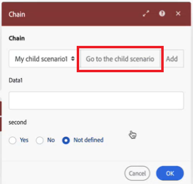

# Enchaînement de plusieurs scénarios

>[!NOTE]
>
>Cette fonctionnalité est actuellement disponible dans Beta.

Vous pouvez enchaîner des scénarios, ce qui permet à un scénario de déclencher un autre et de renvoyer la sortie de données du deuxième scénario au premier. Cela permet de créer des scénarios plus modulaires, où vous n’avez pas à dupliquer des sections de scénario dans plusieurs scénarios.

Vous pouvez appeler plusieurs scénarios enfants à partir d’un scénario parent, et appeler un scénario enfant à partir de plusieurs scénarios parents. Vous pouvez également imbriquer des scénarios enfants, en les appelant les uns des autres.

Lorsqu’un scénario parent attend qu’un scénario enfant renvoie des données, ce temps n’est pas comptabilisé dans le délai d’expiration du scénario parent. Par exemple, un scénario parent appelle 5 scénarios enfants, dont l’exécution prend chacun 10 minutes, pour un total de 50 minutes. L’exécution des modules du scénario parent lui-même prend 15 minutes. Le scénario parent n’expire pas, même si un total de 65 minutes s’est écoulé, ce qui dépasse la limite de délai de 40 minutes.

Pour plus d’informations sur les mécanismes de sécurisation des performances de Fusion, y compris les délais d’expiration, voir [&#x200B; Mécanismes de sécurisation des performances de Fusion &#x200B;](/help/workfront-fusion/references/scenarios/fusion-performance-guardrails.md).

Pour obtenir des instructions sur la configuration des modules Chain, voir [Modules Chain](/help/workfront-fusion/references/apps-and-modules/tools-and-transformers/chain-modules.md).

## Scénarios parents et enfants

* Le scénario **parent** appelle un autre scénario, à l’aide du module **Chaîne** > **Appeler un scénario enfant**. Il reçoit la sortie du scénario enfant, qu’il peut traiter dans les modules de scénario ultérieurs.
* Le scénario **enfant** est appelé par le scénario parent. Son module de déclenchement reçoit les données du scénario parent et renvoie la sortie au scénario parent.

Le scénario parent nécessite une réponse du scénario enfant. Les scénarios enfants qui ne renvoient pas de données ne sont actuellement pas pris en charge.

## Structures de données dans les scénarios en chaîne

Workfront Fusion utilise des structures de données pour transférer des informations du scénario parent vers le scénario enfant. La structure des données est configurée dans le scénario enfant. Lorsque le scénario enfant est sélectionné à partir du scénario parent, les champs de la structure de données utilisée comme entrée du scénario enfant apparaissent dans le scénario parent. Vous pouvez mapper des valeurs à ces champs, qui sont transmises au scénario enfant lorsqu’il est déclenché.

Pour plus d’informations sur les modules à configurer dans les scénarios parent et enfant, voir [Chaîne de modules](/help/workfront-fusion/references/apps-and-modules/tools-and-transformers/chain-modules.md).

Pour plus d’informations sur les structures de données, voir [Structures de données](/help/workfront-fusion/references/mapping-panel/data-types/data-structures.md).

## Flux de données

1. Les données circulent dans le scénario parent.
1. Les données atteignent le module Appeler un scénario enfant . Les données sont mappées aux champs du module Appeler un scénario enfant , qui correspondent aux champs de la structure de données utilisée dans le module de déclenchement du scénario enfant.
1. Les données du scénario Appeler un enfant sont transmises au scénario enfant.
1. Le scénario enfant traite les données et effectue des actions.
1. Le scénario enfant se termine par la réponse Renvoyer au module parent.
1. La sortie de la réponse renvoyée au module parent est transmise au scénario parent.
1. La sortie du scénario « Appeler un enfant » est la sortie du scénario enfant . Cette sortie peut être traitée ultérieurement dans le scénario parent.

## Cas d’utilisation

Tenez compte des cas d’utilisation suivants pour le chaînage de scénarios :

* **Logique réutilisable** : vous pouvez enchaîner des scénarios pour les actions répétées utilisées dans plusieurs scénarios. Par exemple, si plusieurs scénarios archivent du contenu, vous pouvez créer un seul scénario enfant appelé « Archiver le contenu » que vous pouvez ensuite utiliser comme scénario enfant pour tous les workflows qui archivent du contenu.

* **Gestion des erreurs** : il est courant pour les organisations de disposer des mêmes actions de gestion des erreurs dans plusieurs scénarios, par exemple une itinéraire de gestion des erreurs qui envoie un journal des erreurs à un magasin de données et crée une notification Slack. Vous pouvez créer un scénario enfant avec ces actions et enchaîner ce scénario dans des itinéraires de gestion des erreurs dans plusieurs scénarios.

* **Prolonger le temps** : vous pouvez utiliser le chaînage pour les opérations par lots volumineuses avec des actions à long terme, par exemple lorsque vous devez exporter et importer des fichiers. Cette opération prend un certain temps s’il y a de nombreux fichiers. Comme les scénarios enfants ne sont pas comptabilisés dans le délai d’expiration du scénario parent, vous pouvez dépasser le temps d’exécution en utilisant plusieurs scénarios enfants pour exporter ou importer les fichiers.

* **Remplacement des itérateurs** Le remplacement des itérateurs par des scénarios enfants peut réduire l’utilisation de la mémoire, par exemple dans des opérations complexes dans une itération qui provoque une erreur de mémoire insuffisante. Vous pouvez créer un scénario distinct pour l’opération complexe et remplacer l’itérateur par Appeler un module de scénario enfant

* **Rechercher et créer un enregistrement** : par exemple, vous pouvez créer un scénario qui recherche un utilisateur. S’ils existent, le scénario les ajoute en tant qu’approbateurs avec l’accès dont ils ont besoin pour les réviser et les approuver. S’ils n’existent pas, le scénario crée une demande d’intégration d’un nouvel utilisateur pour l’administrateur.

## Affichage de l’historique d’exécution pour les scénarios chaînés

Vous pouvez afficher l&#39;historique d&#39;exécution des scénarios chaînés en affichant l&#39;historique de chaque scénario inclus dans la chaîne. Par exemple, l’historique d’exécution du scénario parent inclut des informations sur les modules et les données traités directement dans le scénario parent. Pour afficher l’historique d’exécution des modules et des données traités dans un scénario enfant, ouvrez le scénario enfant et affichez-y l’historique d’exécution.

Nous vous recommandons d’utiliser le bouton **Accéder au scénario enfant** dans le module Appeler un scénario enfant pour accéder rapidement au scénario enfant, où vous pouvez afficher son historique d’exécution. Le scénario enfant s’ouvre dans une autre fenêtre du navigateur, ce qui vous permet d’afficher les scénarios parents et enfants en même temps.

## Erreurs et exécutions incomplètes

### Gestion des erreurs

Si le scénario enfant génère des erreurs, cela peut avoir une incidence sur la récupération des données chez vos parents.

Nous vous recommandons de configurer la gestion des erreurs dans le scénario enfant afin de vous assurer que si une erreur se produit dans le scénario enfant, le scénario parent n’est pas bloqué en attendant la réponse du scénario enfant.

## Bonnes pratiques

Tenez compte des bonnes pratiques suivantes lors du chaînage d’un scénario.

### Éviter la récursivité lors du chaînage de scénarios

La récursivité se produit lorsqu’un scénario déclenche une nouvelle exécution de lui-même, ce qui déclenche une nouvelle exécution, et ainsi de suite dans une boucle infinie.

La récursivité peut entraîner des problèmes de performances à la fois pour l’organisation propriétaire du scénario récursif et pour d’autres organisations.

Lors du chaînage de scénarios, suivez ces pratiques pour éviter la récursivité :

* Assurez-vous que **les scénarios enfants ne peuvent pas déclencher le scénario parent**. Par exemple, si un scénario parent est déclenché lors de la création d’une requête, assurez-vous que les scénarios enfants ne créent pas de requêtes.
* Assurez-vous que **les scénarios enfants ne s’appellent pas**. Par exemple, si le scénario enfant A appelle le scénario enfant B, assurez-vous que le scénario enfant B n’appelle pas le scénario enfant A.
* Assurez-vous qu’**un scénario ne peut pas s’appeler**. Par exemple, un scénario est déclenché lorsqu’une tâche est créée, et ce scénario crée deux tâches. Les deux nouvelles tâches déclenchent à nouveau le scénario, ce qui crée quatre nouvelles tâches. Chaque fois qu’une tâche est créée, le scénario est déclenché, et chaque fois qu’il s’exécute, le nombre de tâches double. Le nombre de tâches augmente de manière exponentielle.

>[!IMPORTANT]
>
>* **Lorsqu’un scénario provoque une récursivité, il est désactivé par l’équipe d’ingénieurs de Fusion afin d’éviter d’autres problèmes de performances.**
>* La récursivité étant le résultat de la conception de scénario, vous devez concevoir vos scénarios de manière à ce que le scénario n’inclue pas d’actions qui déclenchent le scénario.

### Utilisation de la gestion des erreurs pour garantir une réponse

Comme le scénario parent attend une réponse du scénario enfant avant de pouvoir continuer, vous devez vous assurer que le scénario enfant est créé de sorte qu’il fournisse une réponse même s’il rencontre une erreur.
