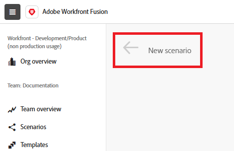

# Workflow de création d’un scénario

Les scénarios sont conçus pour répondre aux besoins de votre entreprise, avec des applications et des modules qui répondent à vos cas d’utilisation. Cependant, la création d’un scénario suit le même workflow de base, quel que soit le cas d’utilisation. Cet article décrit le processus de base de création d’un scénario.

* [Créer et nommer le scénario](#create-and-name-the-scenario)
* [Ajouter et configurer le premier module](#configure-the-first-module)
* [Créer des connexions](#create-connections)
* [Ajout et configuration de modules supplémentaires](#add-and-configure-additional-modules)
* [Mappage des données entre les modules](#map-data-between-modules)
* [Configurer le routage](#configure-routing)
* [Configurer la gestion des erreurs](#configure-error-handling)
* [Configurer les paramètres de scénario](#onfigure-scenario-settings)
* [Tester et réviser](#test-and-revise)
* [Activer le scénario](#activate-the-scenario)
* [Raccourcis clavier du scénario Workfront Fusion](#workfront-fusion-scenario-keyboard-shortcuts)

Raccourcis clavier

## Créer et nommer le scénario

1. Connectez-vous à votre compte Workfront Fusion.
1. Cliquez sur **[!UICONTROL Scénarios]**  dans le panneau de gauche.

   >[!NOTE]
   >
   >Si le panneau de navigation de gauche ou ses icônes ne s’affichent pas, cliquez sur l’icône menu .

1. (Facultatif) Dans le panneau [!UICONTROL **Dossiers**], cliquez sur l’icône **[!UICONTROL Ajouter un dossier]** , puis saisissez un nom tel que « Scénarios d’exercices pratiques » pour votre premier dossier.

1. (Facultatif) Ouvrez le dossier, puis cliquez sur **[!UICONTROL Créer un nouveau scénario]** dans le coin supérieur droit de la page.

1. Sélectionnez le nom de l’espace réservé **[!UICONTROL Nouveau scénario]** dans le coin supérieur gauche, puis saisissez un nom tel que « Scénario pratique 1 ».

   

1. Continuez avec [Connecter le premier module](#2-connect-the-first-module) ci-dessous.

## Ajouter et configurer le premier module

Le premier module de votre scénario est un module de déclenchement qui démarre le scénario lorsque certaines conditions sont remplies.

Pour obtenir des instructions sur l’ajout du premier module à un scénario, voir [Ajouter le premier module à un scénario](/help/workfront-fusion/create-scenarios/add-modules/add-a-module-basic.md#add-the-first-module-to-a-scenario) dans l’article Ajouter un module à un scénario.

Pour obtenir des instructions sur la configuration d’un module, voir [Configuration d’un module](/help/workfront-fusion/create-scenarios/add-modules/configure-a-modules-settings.md)

## Créer des connexions

Lors de la configuration d’un module, vous devez entrer ou créer une connexion. Le module utilise cette connexion et les autorisations qu’elle contient pour accéder à la date dans l’application.

Pour obtenir des instructions de base sur la création d’une connexion, voir [Créer une connexion - Instructions de base](/help/workfront-fusion/create-scenarios/connect-to-apps/connect-to-fusion-general.md).

Pour des cas d’utilisation spécifiques impliquant Google, Microsoft ou des applications sans connecteurs dédiés, consultez les autres articles sous [Se connecter aux applications : index des articles](/help/workfront-fusion/create-scenarios/connect-to-apps/connect-to-apps-toc.md).

## Ajout et configuration de modules supplémentaires

Continuez à ajouter et à configurer des modules supplémentaires.

Pour obtenir des instructions sur l’ajout de modules, consultez les articles répertoriés sous [Ajouter des modules : index des articles](/help/workfront-fusion/create-scenarios/add-modules/add-modules-toc.md).

## Mappage des données entre les modules

Vous pouvez utiliser la sortie des modules précédents comme entrée dans les modules suivants. Par exemple, vous pouvez créer un projet Workfront dans un module et charger un document dans ce module dans un module suivant.

Pour obtenir des instructions, consultez les articles sous [Mapper des données : index d’article](/help/workfront-fusion/create-scenarios/map-data/map-data-toc.md).

## Configurer le routage

Le routage permet au scénario d’effectuer différentes actions en fonction des valeurs des données.

Pour obtenir des instructions, voir [Ajouter un module Routeur et configurer des itinéraires](/help/workfront-fusion/create-scenarios/add-modules/router-module.md).

## Configurer la gestion des erreurs

La gestion des erreurs permet au scénario de récupérer après une erreur. Vous pouvez choisir la manière dont vous souhaitez que le scénario réagisse dans différentes situations d’erreur.

Pour obtenir des instructions, voir [Ajouter la gestion des erreurs](/help/workfront-fusion/create-scenarios/config-error-handling/error-handling.md).

## Configurer les paramètres de scénario

Vous pouvez configurer des paramètres pour votre scénario dans son ensemble, par exemple pour planifier un scénario, prendre des notes ou déterminer comment les données sont stockées.

Pour obtenir des instructions, consultez les articles sous [Configurer les paramètres de scénario : index d’article](/help/workfront-fusion/create-scenarios/config-scenarios-settings/config-scenario-settings-toc.md).

## Tester et réviser

Le test de votre scénario vous permet de déterminer si celui-ci fonctionne comme prévu. Vous pouvez ensuite réviser le scénario en fonction de vos résultats, puis effectuer un nouveau test.

1. Cliquez sur **[!UICONTROL Exécuter une fois]** dans le coin inférieur gauche de l’éditeur de scénario.
1. Une fois l’exécution du scénario terminée, cliquez sur la bulle de l’inspecteur d’exécution au-dessus de chaque module pour afficher l’entrée des informations et la sortie de ce module.

   * Pour obtenir des informations générales sur la lecture des informations d’exécution de scénario, voir [Flux d’exécution de scénario](/help/workfront-fusion/references/scenarios/scenario-execution-flow.md).
   * Pour plus d’informations sur les lots traités, voir [Exécution de scénario, cycles et phases dans Adobe Workfront Fusion](/help/workfront-fusion/references/scenarios/scenario-execution-cycles-phases.md).

1. Dans Workfront Fusion, cliquez sur **[!UICONTROL Enregistrer]**  près du coin inférieur gauche pour enregistrer votre progression dans le scénario.

   >[!IMPORTANT]
   >
   >Sauvegardez souvent lorsque vous affinez et testez un scénario.

## Activer le scénario

Cet exemple de scénario ne comporte pas de module de déclenchement. S’il s’agissait d’un scénario que vous utiliseriez pour des données réelles, il commencerait par un module de déclenchement, et la dernière chose que vous feriez serait de l’activer. Une fois que vous avez activé un scénario, celui-ci s’exécute par défaut toutes les 15 minutes. Vous pouvez modifier cela en définissant quand et à quelle fréquence vous souhaitez qu’il s’exécute.

Pour plus d’informations sur l’activation des scénarios, voir [ Activer ou désactiver un scénario](/help/workfront-fusion/manage-scenarios/activate-deactivate-scenarios.md).

Pour plus d’informations sur les planifications, voir [Planification d’un scénario](/help/workfront-fusion/create-scenarios/config-scenarios-settings/schedule-a-scenario.md).

## Raccourcis clavier du scénario Workfront Fusion

Vous pouvez utiliser les raccourcis clavier suivants lors de la création ou de la modification d’un scénario :

<table style="table-layout:auto"> 
 <col data-mc-conditions=""> 
 <col data-mc-conditions=""> 
 <col data-mc-conditions=""> 
 <thead> 
  <tr> 
   <th> 
Action
 </th> 
   <th>[!DNL Windows]</th> 
   <th> 
[!DNL MacOS]
 </th> 
  </tr> 
 </thead> 
 <tbody> 
  <tr> 
   <td role="rowheader">[!UICONTROL Save] </td> 
   <td>Ctrl+Maj+S</td> 
   <td>Cmd+Maj+S </td> 
  </tr> 
  <tr> 
   <td role="rowheader">[!UICONTROL Run Once]</td> 
   <td>Ctrl+Maj+Entrée</td> 
   <td>Cmd+Maj+Entrée </td> 
  </tr> 
  <tr> 
   <td role="rowheader">[!UICONTROL Ouvrir l’outil de développement]</td> 
   <td>F12</td> 
   <td>Ctrl+Fn+F12 </td> 
  </tr> 
  <tr> 
   <td role="rowheader">[!UICONTROL Sélectionner plusieurs modules]</td> 
   <td>Maj+Glisser</td> 
   <td>Maj+Glisser </td> 
  </tr> 
  <tr> 
   <td role="rowheader">[!UICONTROL Copy]</td> 
   <td>Ctrl+C</td> 
   <td>Cmd+C </td> 
  </tr> 
  <tr> 
   <td role="rowheader">[!UICONTROL Paste]</td> 
   <td>Ctrl+V</td> 
   <td>Cmd+V </td> 
  </tr> 
  <tr> 
   <td role="rowheader">[!UICONTROL Rechercher des modules]</td> 
   <td>Ctrl+K</td> 
   <td>Cmd+K </td> 
  </tr> 
  <tr> 
   <td role="rowheader">Collez cURL dans le scénario pour créer le module HTTP .</td> 
   <td colspan="2">Copiez cURL, puis collez-la n’importe où dans l’éditeur de scénarios.
Pour plus d’informations, voir <a href="/help/workfront-fusion/create-scenarios/add-modules/use-curl-create-http.md">Utiliser cURL pour ajouter un module HTTP</a>.</td> 
  </tr> 
 </tbody> 
</table>

