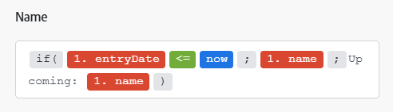

# Vue d’ensemble du mappage

Le mappage désigne le processus d’affectation des sorties d’un module aux champs d’entrée d’un autre.

L’opération d’un module produit zéro, un ou plusieurs lots en tant que sortie. Un lot se compose d’un ou de plusieurs éléments.

Vous pouvez mapper ces éléments aux champs dans les modules ultérieurs.

Lorsque vous cliquez sur un champ dans lequel vous souhaitez insérer une valeur émise par un module précédent dans un scénario, le panneau de mappage s’affiche. Ici, vous pouvez sélectionner l’élément à mapper. Un mappage peut inclure un ou plusieurs des éléments suivants :

* Un seul élément
* Plusieurs éléments
* Texte statique
* Fonctions

>[!BEGINSHADEBOX]

**Exemples** :

Un seul élément

Plusieurs éléments avec du texte

Fonction avec plusieurs éléments et du texte

>[!ENDSHADEBOX]

Pour plus d’informations sur le mappage, consultez les articles dans [Mapper des données : index des articles](/help/workfront-fusion/create-scenarios/map-data/map-data-toc.md).

>[!NOTE]
>
>Les sorties des modules placés entre un [!UICONTROL itérateur] et [!UICONTROL agrégateur] ne sont pas accessibles au-delà du module [!UICONTROL agrégateur].

## Panneau de mappage

Lorsque vous cliquez dans un champ où vous pouvez mapper des données, le panneau de mappage s’ouvre.

Le premier onglet  affiche les éléments que vous pouvez mapper à partir d’autres modules.

Les autres onglets comprennent des fonctions, des opérateurs et des mots-clés que vous pouvez utiliser pour créer des formules. Ils sont triés dans différents onglets en fonction du type de données traité.

Pour plus d’informations sur les onglets de fonctions, consultez [Vue d’ensemble des fonctions](/help/workfront-fusion/get-started-with-fusion/understand-fusion/function-overview.md).

Pour plus d’informations sur le mappage d’éléments à l’aide de fonctions, voir [&#x200B; Mappage d’éléments à l’aide de fonctions intégrées &#x200B;](/help/workfront-fusion/create-scenarios/map-data/map-using-functions.md).

## Collections

Des éléments peuvent contenir plusieurs valeurs de différents types. Il s’agit d’éléments de type collection.

Les lots de type collection affichent `(Collection)` en regard du libellé du lot dans la sortie du module.

Dans la plupart des cas, vous mappez les éléments de la collection plutôt que l’élément représentant l’ensemble de la collection.

Pour localiser l’élément d’une collection dans le panneau de mappage, cliquez sur la flèche en regard de la collection.

Pour plus d’informations sur les collections, consultez [Types de données d’élément](/help/workfront-fusion/references/mapping-panel/data-types/item-data-types.md).

Pour plus d’informations sur le mappage des collections, consultez la section [Mapper un élément](/help/workfront-fusion/create-scenarios/map-data/map-data-from-one-to-another.md#map-an-item) de l’article Mapper des informations d’un module à un autre.

## Tableaux

Des éléments peuvent contenir plusieurs éléments du même type. Il s’agit d’éléments de type tableau.

Les lots de type tableau affichent `(Array)` en regard du libellé du lot dans la sortie du module.

Dans le panneau de mappage, les tableaux s’affichent avec des crochets. Vous pouvez identifier un élément de type tableau par les crochets à la fin du libellé de l’élément. Pour localiser un élément de tableau spécifique dans le panneau de mappage, cliquez sur la flèche en regard du tableau.

Pour plus d’informations et d’instructions sur le mappage de tableaux et d’éléments de tableau, consultez [Mapper des tableaux et des éléments de tableau](/help/workfront-fusion/create-scenarios/map-data/map-an-array.md).
