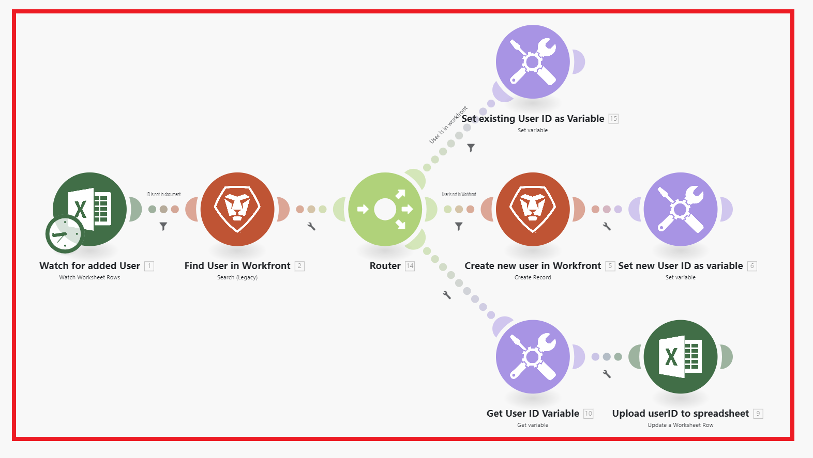

# Présentation du scénario

Le rôle d’Adobe Workfront Fusion est d’automatiser vos processus afin que vos utilisateurs n’aient pas besoin de passer autant de temps sur des tâches de routine. La plateforme fonctionne en liant les actions dans et entre les applications et les services pour créer un scénario qui transfère et transforme vos données automatiquement. Le scénario que vous créez recherche les données dans une application ou un service et traite ces données pour obtenir le résultat souhaité.

Un scénario se compose d’une série de modules qui indiquent comment les données doivent être transformées dans une application ou transférées entre les applications et les services web.

## Présentation des éléments de scénario

Un scénario est constitué de différents éléments. La compréhension de la terminologie de ces éléments facilite l’utilisation de la documentation.

* [Scénario](#scenario)
* [Déclencheur](#trigger)
* [Module](#module)
* [Itinéraire](#route)
* [Segment de scénario](#scenario-segment)
* [Connecteur](#connector)

### Scénario

Un **scénario** est une série d’étapes automatisées créées par l’utilisateur ou l’utilisatrice pour déplacer et manipuler des données. Le terme « scénario » fait référence à l’ensemble du groupe d’étapes connectées.

### Déclencheur

Un scénario commence par un **déclencheur**. Le déclencheur recherche les données nouvelles et mises à jour et démarre le scénario lorsque certaines conditions configurées dans le module s’appliquent. Les Triggers peuvent être configurés pour démarrer un scénario selon un planning (interrogation) ou chaque fois que des modifications de données se produisent (instant).

### Module

Le déclencheur est suivi d’un certain nombre de **modules**. Un module représente une seule étape dans un scénario qui exécute une action spécifique. Les modules sont configurés et liés ensemble pour créer des scénarios.

### Itinéraire

Un scénario peut être divisé en **itinéraires**. Une route est une section du scénario qui peut être utilisée ou non pour un lot de données donné. Les itinéraires sont configurés à l&#39;aide d&#39;un module de routeur et de filtres.

### Segment de scénario

Un segment de scénario est une section d’un scénario qui se compose d’une série de modules contigus qui se connectent tous à la même application. Les segments de scénario représentent souvent un workflow court dans l’application.

### Connecteur

Un connecteur correspond à l’ensemble des modules d’une application donnée. Workfront Fusion offre des connecteurs à de nombreuses applications de travail courantes, telles que Workfront, Salesforce et Jira, ainsi que des connecteurs génériques qui peuvent être utilisés pour n’importe quel service web.

## Exemples

Développez les sections suivantes pour afficher des exemples de scénarios et leurs explications.

+++**Automatisation des processus dans Adobe Workfront**

Workfront Fusion vous permet d’automatiser des workflows simples ou complexes dans Workfront, ce qui vous permet de gagner du temps et de vous assurer que le processus est exécuté de manière cohérente.

Dans cet exemple, le scénario se déclenche lorsqu’un champ spécifié est modifié dans une tâche ou un événement dans Workfront. Lorsqu’il est déclenché, le scénario récupère des informations dans le projet concerné et crée une mise à jour personnalisée pour une personne affectée à un rôle spécifique dans le projet.

+++

+++**Connexion de Workfront à une autre application ou à un autre service web**

>[!NOTE]
>
>Si votre entreprise utilise le modèle de licence hérité, elle doit disposer d’une licence Workfront Fusion for Work Automation and Integration pour se connecter à d’autres applications.

Workfront Fusion peut se connecter à d’autres applications et services web. Vous pouvez accéder aux données d’autres applications, les importer, les manipuler ou les exporter, les intégrer à Workfront ou entre elles.

De nombreuses applications disposent de connecteurs Workfront Fusion dédiés. S’il n’existe aucun connecteur dédié pour l’application à laquelle vous souhaitez accéder, vous pouvez utiliser les modules HTTP ou SOAP de Workfront Fusion pour vous connecter à l’application via son API.

Dans cet exemple, le scénario se déclenche lors de l’ajout d’un utilisateur ou d’une utilisatrice à une feuille de calcul [!DNL Excel]. Le scénario vérifie si l’utilisateur se trouve dans Workfront. Si ce n’est pas le cas, le scénario crée l’utilisateur dans Workfront et ajoute son identifiant utilisateur Workfront à la feuille de calcul.

Pour obtenir la liste des connecteurs dédiés, voir [Références des applications Fusion et de leurs modules : index d’article](/help/workfront-fusion/references/apps-and-modules/apps-and-modules-toc.md).

>[!IMPORTANT]
>
>Adobe Workfront Fusion peut se connecter à presque tous les services web. Si l’application avec laquelle vous souhaitez travailler ne dispose pas d’un connecteur Workfront Fusion dédié, vous pouvez utiliser des connecteurs universels pour vous connecter à l’application ou au service.
>
>Pour obtenir la liste des connecteurs universels, voir [Connecteurs universels](/help/workfront-fusion/references/apps-and-modules/apps-and-modules-toc.md#universal-connectors)

+++

## Références

* Pour obtenir un glossaire des termes utilisés dans Workfront Fusion, consultez [Glossaire Adobe Workfront Fusion](/help/workfront-fusion/get-started-with-fusion/understand-fusion/fusion-glossary.md).
* Pour commencer à créer un scénario d’exercice, voir [Création d’un scénario de base](/help/workfront-fusion/build-practice-scenarios/create-basic-scenario.md).
* Pour plus d’informations sur la création et la gestion des scénarios, consultez les articles répertoriés sous :
   * [Créer des scénarios](/help/workfront-fusion/create-scenarios/create-scenarios-toc.md)
   * [Gestion des scénarios](/help/workfront-fusion/manage-scenarios/manage-scenarios-toc.md)
