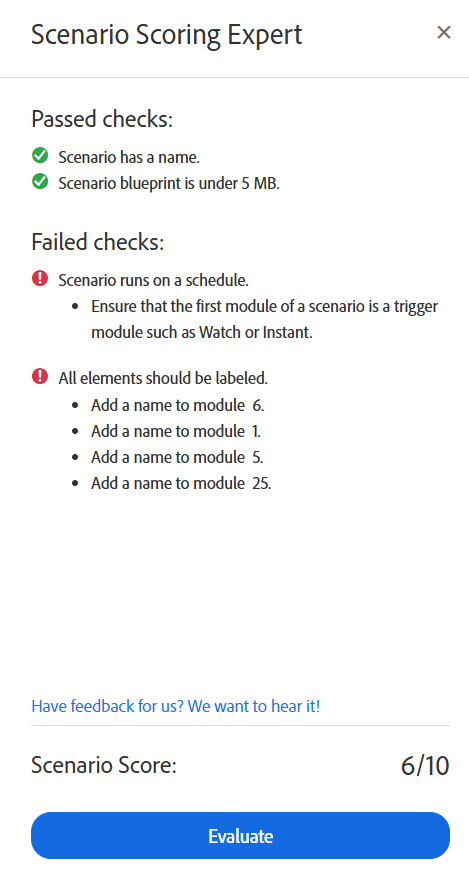

# Exécuter l’expert en notation de scénario

>[!IMPORTANT]
>
>L’expert en notation de scénario a été temporairement désactivé.

L’expert en notation de scénario peut vous aider à vous assurer que votre scénario est configuré de manière à suivre les bonnes pratiques. Il vérifie votre scénario et fournit des recommandations pour sa structure et son organisation.

## Conditions d’accès

+++ Développez pour afficher les exigences d’accès aux fonctionnalités de cet article.

Vous devez disposer des accès suivants pour utiliser les fonctionnalités de cet article :

<table style="table-layout:auto">
 <col> 
 <col> 
 <tbody> 
  <tr> 
   <td role="rowheader">Package Adobe Workfront</td> 
   <td> 
Tous
 </td> 
  </tr> 
  <tr data-mc-conditions=""> 
   <td role="rowheader">Licence Adobe Workfront</td> 
   <td> 
Nouveau : Standard

Ou

Actuelle : [!UICONTROL Work] ou niveau supérieur
 </td> 
  </tr> 
  <tr> 
   <td role="rowheader">Licence Adobe Workfront Fusion **</td> 
   <td>
   
Actuel : aucune exigence de licence Workfront Fusion.

   
Ou

   
Héritée : n’importe laquelle. 

   </td> 
  </tr> 
  <tr> 
   <td role="rowheader">Produit</td> 
   <td>
   
Nouveau :
 <ul><li>Plan Workfront [!UICONTROL Select] ou [!UICONTROL Prime] : votre entreprise doit acheter Adobe Workfront Fusion.</li><li>Plan Workfront [!UICONTROL Ultimate] : Workfront Fusion est inclus.</li></ul>
   
Ou

   
Actuel : votre entreprise doit acheter Adobe Workfront Fusion.

   </td> 
  </tr>
  <tr data-mc-conditions=""> 
   <td role="rowheader">Configurations du niveau d’accès*</td> 
   <td> 
     
Vous devez être administrateur ou administratrice Workfront Fusion pour votre entreprise.

     
Vous devez être un administrateur Workfront Fusion pour votre équipe.

   </td> 
  </tr> 
   </td> 
  </tr> 
 </tbody> 
</table>

Pour plus d’informations sur les informations contenues dans ce tableau, voir [Conditions d’accès requises dans la documentation](/help/workfront-fusion/references/licenses-and-roles/access-level-requirements-in-documentation.md).

Pour plus d’informations sur les licences Adobe Workfront Fusion, voir [Licences Adobe Workfront Fusion](/help/workfront-fusion/set-up-and-manage-workfront-fusion/licensing-operations-overview/license-automation-vs-integration.md).

+++

## Exécuter l’expert en notation de scénario

1. Cliquez sur l’onglet **[!UICONTROL Scénarios]** dans le panneau de gauche.
1. Sélectionnez le scénario dans lequel vous souhaitez exécuter l’expert en notation de scénario.
1. Cliquez n’importe où sur le scénario pour accéder à l’éditeur de scénarios.
1. Cliquez sur l’icône d’expert en notation de scénario  en bas de l’écran.

   Le panneau d’experts en notation de scénario s’ouvre.
1. Cliquez sur **Évaluer**.

L’expert en notation de scénario renvoie une note sur 10 et indique les vérifications qui ont réussi ou échoué. Si une vérification a échoué, l’expert en notation de scénario fournit des recommandations sur la manière de s’assurer que le scénario répond à ces vérifications.

## Vérifications du score du scénario

L’expert en notation de scénario effectue les vérifications suivantes :

* Le scénario doit être nommé.
* Tous les modules doivent être étiquetés.
* Le scénario doit s’exécuter selon un planning défini.

  Pour obtenir des instructions, voir [Planification d’un scénario](/help/workfront-fusion/create-scenarios/config-scenarios-settings/schedule-a-scenario.md).
* La taille du plan directeur du scénario doit être inférieure à 5 Mo.

  Pour plus d’informations, voir [&#x200B; Mécanismes de sécurisation des performances de Fusion &#x200B;](/help/workfront-fusion/references/scenarios/fusion-performance-guardrails.md#scenarios).
* Si un module de déclenchement instantané Workfront est utilisé, il doit être filtré.

  Pour plus d’informations, consultez la section [Filtres d’abonnement aux événements du module Workfront > [!UICONTROL Événements Espion]](/help/workfront-fusion/references/apps-and-modules/adobe-connectors/workfront-modules.md#event-subscription-filters-in-the-workfront--watch-events-modules).
