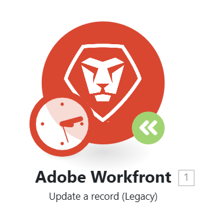

# Mettre à niveau un module vers une nouvelle version

Comme les applications auxquelles Workfront Fusion se connecte peuvent mettre à jour ou publier de nouvelles versions, il est parfois nécessaire que Fusion publie des modules mis à jour pour ces applications.

Si l’icône verte du module de mise à niveau s’affiche sur un module dans un scénario, Workfront Fusion a publié une nouvelle version de ce module.

Vous pouvez mettre à jour le module sans créer de scénario.

## Conditions d’accès

+++ Développez pour afficher les exigences d’accès aux fonctionnalités de cet article.

<table style="table-layout:auto">
 <col> 
 <col> 
 <tbody> 
  <tr> 
   <td role="rowheader">Package Adobe Workfront</td> 
   <td> 
Tout package de workflow Adobe Workfront et tout package d’automatisation et d’intégration Adobe Workfront

Workfront Ultimate

Packages Workfront Prime et Select, avec l’achat supplémentaire de Workfront Fusion.
 </td> 
  </tr> 
  <tr data-mc-conditions=""> 
   <td role="rowheader">Licences Adobe Workfront</td> 
   <td> 
Standard

Travail ou supérieur
 </td> 
  </tr> 
  <tr> 
   <td role="rowheader">Produit</td> 
   <td>
   
Si votre organisation dispose d’un package Workfront Select ou Prime qui n’inclut pas l’automatisation et l’intégration de Workfront, elle doit acquérir Adobe Workfront Fusion.</li></ul>
   </td> 
  </tr>
 </tbody> 
</table>

Pour plus d’informations sur le contenu de ce tableau, consultez [Conditions d’accès requises dans la documentation](/help/workfront-fusion/references/licenses-and-roles/access-level-requirements-in-documentation.md).

+++

## Mise à niveau d’un module Workfront vers une nouvelle version

1. Cliquez sur l’icône **Mettre à niveau le module**  du module que vous souhaitez mettre à niveau vers une nouvelle version.
   
1. Choisissez l’une des options suivantes :

   * Pour sélectionner un nouveau module pour remplacer ce module (au lieu de mettre à niveau le module), cliquez sur **Choisir nouveau**, puis procédez comme décrit dans [Mettre à niveau un module non Workfront vers une nouvelle version](#upgrade-a-non-workfront-module-to-a-new-version).
   * Pour mettre à niveau uniquement ce module, en conservant la configuration du module, cliquez sur **Mettre à niveau**.
   * Pour mettre à niveau tous les modules Workfront du scénario, cliquez sur **Tout mettre à niveau**.

1. Enregistrez le scénario.

>[!NOTE]
>
>Si vous avez mis à niveau les modules Workfront, nous vous recommandons de les ouvrir et de vérifier leur configuration.

## Mettre à niveau un module non Workfront vers une nouvelle version

1. Cliquez sur l’icône **Mettre à niveau le module**  du module que vous souhaitez mettre à niveau vers une nouvelle version.
   
1. Cliquez sur **Choisir nouveau**.
1. Sélectionnez le module qui doit remplacer le module précédent.
1. Configurez le module avec les mêmes paramètres que le module existant.
1. Connectez le nouveau module au scénario au même endroit que le module existant.
1. Supprimez l’ancien module.
1. Enregistrez le scénario.
