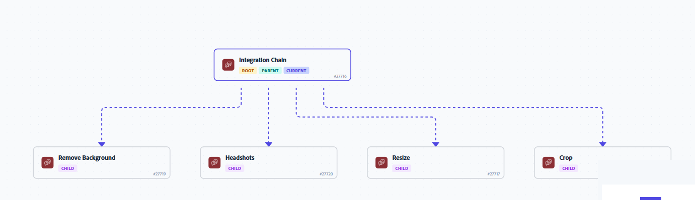

# Afficher et gérer les relations de scénario chaîné

Vous pouvez mapper les relations entre les scénarios parents et enfants. Vous pouvez également utiliser la carte pour accéder à différents scénarios de la chaîne.

Pour plus d’informations sur les scénarios chaînés, voir [Enchaîner plusieurs scénarios](/help/workfront-fusion/create-scenarios/plan-a-scenario/chain-scenarios.md).

Pour plus d&#39;informations sur la configuration des scénarios chaînés, voir [Modules de chaîne](/help/workfront-fusion/references/apps-and-modules/tools-and-transformers/chain-modules.md)

## Conditions d’accès

+++ Développez pour afficher les exigences d’accès aux fonctionnalités de cet article.

<table style="table-layout:auto">
 <col> 
 <col> 
 <tbody> 
  <tr> 
   <td role="rowheader">Package Adobe Workfront</td> 
   <td> 
Tout package de workflow Adobe Workfront et tout package d’automatisation et d’intégration Adobe Workfront

Workfront Ultimate

Packages Workfront Prime et Select, avec l’achat supplémentaire de Workfront Fusion.
 </td> 
  </tr> 
  <tr data-mc-conditions=""> 
   <td role="rowheader">Licences Adobe Workfront</td> 
   <td> 
Standard

Travail ou supérieur
 </td> 
  </tr> 
  <tr> 
   <td role="rowheader">Produit</td> 
   <td>
   
Si votre organisation dispose d’un package Workfront Select ou Prime qui n’inclut pas l’automatisation et l’intégration de Workfront, elle doit acquérir Adobe Workfront Fusion.</li></ul>
   </td> 
  </tr>
 </tbody> 
</table>

Pour plus d’informations sur le contenu de ce tableau, consultez [Conditions d’accès requises dans la documentation](/help/workfront-fusion/references/licenses-and-roles/access-level-requirements-in-documentation.md).

+++

## Afficher une carte des relations chaînées

Vous pouvez afficher une carte du scénario actuel et de ses scénarios parents ou enfants. La carte affiche un diagramme du flux de données dans les scénarios chaînés.

<!--get a better picture-->

Pour afficher la carte des relations pour un scénario chaîné :

1. Cliquez sur l’onglet **[!UICONTROL Scénario]** dans le panneau de gauche, puis sur le scénario.

   Ou

   Si vous travaillez sur le scénario dans l’éditeur de scénarios, cliquez sur la flèche de gauche  près du coin supérieur gauche de la fenêtre.

1. Cliquez sur l’onglet **Relations**.

   

1. Pour obtenir des détails généraux sur chaque scénario chaîné, vérifiez les balises .

   Chaque scénario comporte une ou plusieurs des balises suivantes :

   * Racine : le scénario est le début de la chaîne et n’a pas de scénario parent.
   * Parent : le scénario est un scénario parent.
   * Enfant : le scénario est un scénario enfant. Un scénario peut être à la fois un parent et un enfant.
   * Actuel : il s’agit du scénario que l’utilisateur consulte actuellement. En d’autres termes, il s’agit du scénario à partir duquel l’utilisateur a ouvert la carte des relations.

   
1. (Facultatif) Pour afficher un petit diagramme d’un scénario, passez la souris sur le scénario.
1. (Facultatif) pour accéder directement à un autre scénario à partir de la carte, cliquez sur le scénario.

   Le scénario sur lequel l’utilisateur a cliqué s’ouvre dans une autre fenêtre.
1. (Facultatif) Pour basculer entre les vues horizontale et verticale de la carte, cliquez sur **Horizontal** ou **Vertical** près du coin supérieur droit de la page Détails du scénario.
1. (Facultatif) Pour afficher une vue simplifiée de la carte, vérifiez le coin inférieur droit de la page.

   Cela peut s&#39;avérer pratique si votre schéma de chaîne est volumineux ou complexe.

   * Si vous ne visualisez qu&#39;une partie de la carte, cette partie est plus sombre sur la carte simplifiée.
   * Le scénario actuel est marqué en bleu sur la carte simplifiée.

