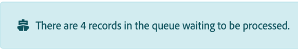
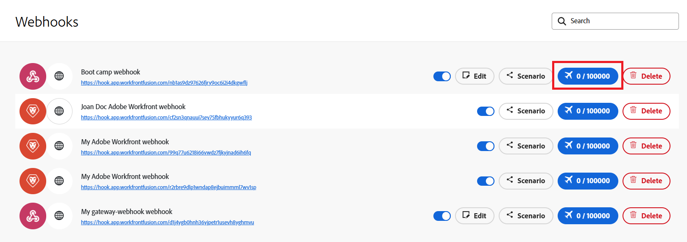

# Afficher la file d’attente d’un webhook

De nombreux services proposent des webhooks pour envoyer des notifications instantanées chaque fois que le service est modifié. Les déclencheurs instantanés, également appelés webhooks, peuvent utiliser ces événements pour lancer des scénarios. Les événements sont placés dans la file d’attente du webhook lorsqu’ils sont en attente de traitement, par exemple lorsque le scénario est déjà en cours d’exécution. Vous pouvez afficher la file d’attente du webhook.

Les données webhook entrantes sont toujours stockées dans la file d’attente, quelle que soit la manière dont vous avez défini l’option Les données sont confidentielles dans le panneau des paramètres du scénario. Une fois les données traitées dans un scénario, elles sont définitivement supprimées de la file d’attente.

Pour plus d’informations sur les webhooks, consultez la section [Déclencheurs instantanés (webhooks)](/help/workfront-fusion/references/modules/webhooks-reference.md).

## Conditions d’accès

+++ Développez pour afficher les exigences d’accès aux fonctionnalités de cet article.

<table style="table-layout:auto">
 <col> 
 <col> 
 <tbody> 
  <tr> 
   <td role="rowheader">Package Adobe Workfront</td> 
   <td> 
Tout package de workflow Adobe Workfront et tout package d’automatisation et d’intégration Adobe Workfront

Workfront Ultimate

Packages Workfront Prime et Select, avec l’achat supplémentaire de Workfront Fusion.
 </td> 
  </tr> 
  <tr data-mc-conditions=""> 
   <td role="rowheader">Licences Adobe Workfront</td> 
   <td> 
Standard

Travail ou supérieur
 </td> 
  </tr> 
  <tr> 
   <td role="rowheader">Produit</td> 
   <td>
   
Si votre organisation dispose d’un package Workfront Select ou Prime qui n’inclut pas l’automatisation et l’intégration de Workfront, elle doit acquérir Adobe Workfront Fusion.</li></ul>
   </td> 
  </tr>
 </tbody> 
</table>

Pour plus d’informations sur le contenu de ce tableau, consultez [Conditions d’accès requises dans la documentation](/help/workfront-fusion/references/licenses-and-roles/access-level-requirements-in-documentation.md).

+++

## Afficher la file d’attente d’un webhook

Tous les messages des webhooks entrants sont stockés dans la file d’attente du webhook.

Si un scénario comporte actuellement une file d’attente, une bannière s’affiche dans ce scénario :

Pour afficher la file d’attente d’un webhook :

1. Cliquez sur **[!UICONTROL Webhooks]** dans le menu de gauche.
1. Recherchez le Webhook pour lequel vous souhaitez afficher la file d’attente.
1. Recherchez le nombre d’événements dans le bouton Événements reçus .

   

1. Cliquez sur le bouton pour afficher les détails des événements dans la file d’attente.
