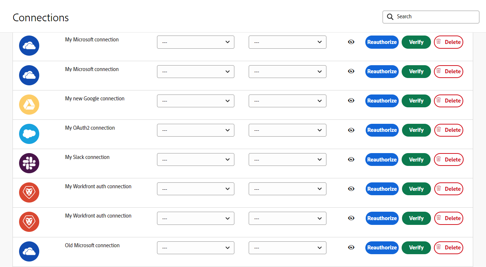

# Métadonnées de connexion

Fusion utilise des métadonnées pour identifier les attributs importants d’une connexion.

Les métadonnées de connexion peuvent être définies lors de la création d’une nouvelle connexion. Ces attributs se trouvent dans la même boîte de dialogue que celle utilisée pour établir une connexion :

Les utilisateurs et utilisatrices de Fusion peuvent afficher et modifier les connexions à partir de la zone Connexions.

## Type d’environnement

Les connexions Fusion peuvent être utilisées par les systèmes de production et non-production. Vous pouvez marquer le type d’environnement auquel une connexion se connecte, ce qui permet de protéger les environnements de production.

Le type d’environnement, comme les autres métadonnées de connexion, est utilisé à titre d’information uniquement. Les utilisateurs et utilisatrices sont chargés de définir précisément cet attribut et d’utiliser une connexion avec l’environnement approprié dans un scénario.

## Type d&#39;authentification

Les connexions Fusion peuvent être utilisées à la fois pour les comptes de service et les comptes personnels. Les comptes de service sont utilisés pour l’authentification lorsqu’un scénario s’automatise comme Fusion. Les comptes personnels sont des authentifications basées sur une personne spécifique. Le type d’authentification dépend des exigences du scénario. Les comptes personnels doivent être utilisés pour les actions automatisées des utilisateurs et utilisatrices. Par exemple, si un scénario Fusion automatise l’approbation par une personne spécifique, le type d’authentification doit être celui de cette personne. Dans le cas contraire, Fusion agit comme Fusion et le type doit être Compte de service.

Le type d’authentification, comme les autres métadonnées de connexion, est utilisé à titre d’information uniquement. Les utilisateurs et utilisatrices sont chargés de définir précisément cet attribut et d’utiliser le type de connexion correct dans un scénario.

Pour plus d’informations sur les types d’authentification, voir [Authentification](https://developer.adobe.com/developer-console/docs/guides/authentication/) dans le guide de l’authentification Adobe.

## Ressources

* Pour obtenir des instructions sur la gestion des métadonnées de connexion, voir [Gestion des connexions](/help/workfront-fusion/create-scenarios/connect-to-apps/manage-connections.md).
