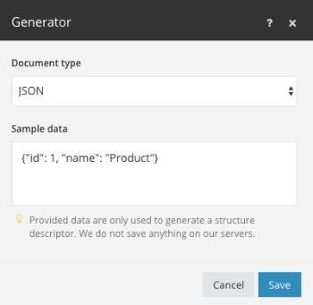

# Structures de données

Une structure de données est un document ou un motif qui décrit en détail le format des données traitées dans Adobe Workfront Fusion. Sur la base de ce document, l’éditeur de scénario peut déterminer quel module renvoie ou reçoit quel type de données. Les structures de données sont généralement utilisées pour sérialiser ou analyser des formats de données tels que JSON, XML, CSV, etc

Vous pouvez créer une structure de données en cliquant sur le bouton [!UICONTROL Créer une structure de données] dans la section [!UICONTROL Vue d’ensemble de la structure de données] ou dans les paramètres du module qui nécessite la spécification de la structure de données.

Les types de données pris en charge sont décrits dans l’article [Types de données](/help/workfront-fusion/references/mapping-panel/data-types/item-data-types.md).

## Générateur de structure de données

Il n’est pas toujours nécessaire de créer des structures de données. Workfront Fusion peut générer des structures de données à partir de données existantes. Vous fournissez un échantillon de données, puis le générateur crée automatiquement une structure de données en fonction de cet échantillon. Vous pouvez ensuite modifier manuellement la structure de données créée si nécessaire.

Pour générer une structure de données, consultez [Configurer la structure de données](/help/workfront-fusion/create-scenarios/map-data/data-stores.md#set-up-the-data-structure) dans l’article Magasins de données.

