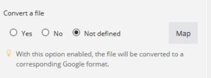

# Types de données d’élément

Vous pouvez contenir les types d’éléments répertoriés ci-dessous dans un lot.

Pour plus d’informations sur les types d’éléments que Workfront Fusion permet de convertir, voir [Type coercition](/help/workfront-fusion/references/mapping-panel/data-types/type-coercion.md).

<table style="table-layout:auto">
 <col> 
 <col> 
 <tbody> 
  <tr> 
   <td role="rowheader"> 
Texte
 </td> 
   <td> 
Type d’élément le plus courant. Pour certains éléments de texte, Adobe Workfront Fusion vérifie si la longueur maximale ou minimale autorisée est respectée ou si l’élément effectue une validation du format (e-mail, URL ou nom de fichier).
 </td> 
  </tr> 
  <tr> 
   <td role="rowheader"> 
Nombre
 </td> 
   <td> 
Pour certains éléments numériques, Workfront Fusion peut valider l’entrée pour une plage spécifiée (la valeur minimale ou maximale autorisée).
 </td> 
  </tr> 
  <tr> 
   <td role="rowheader"> 
Booléen (oui/non)
 </td> 
   <td> 
Ce type est utilisé pour les éléments qui n’ont que deux valeurs possibles : true ou false. 
 
Lors de la définition de modules, le type booléen peut apparaître sous deux formes différentes :
 
    <ul> 
     <li> 
La case à cocher obligatoirement s’affiche si le champ est obligatoire et doit être renseigné.
 
  
 </li> 
     <li> 
Les champs facultatifs qui peuvent rester vides s’affichent sous forme de zone de sélection, ce qui permet d’effectuer une sélection parmi trois valeurs : <code>Yes</code>, <code>No</code>, et <code>Not defined</code> (par défaut).
 
  
 </li> 
    </ul> 
Cliquez sur <strong>[!UICONTROL Map]</strong> si vous devez mapper la valeur à un élément à partir d’un autre module.
 </td> 
  </tr> 
  <tr> 
   <td role="rowheader"> 
Date
 </td> 
   <td> 
Les dates sont saisies au format de date ISO 8601, par exemple : <code>2015-09-18T11:58Z</code>. Vous pouvez modifier le fuseau horaire dans les paramètres de votre profil. 
 
Si vous cliquez sur un champ qui nécessite une date, un calendrier contextuel s’affiche dans les paramètres du module. L’heure n’est pas nécessaire pour certains éléments.
 
Les valeurs des éléments de date sont formatées à l’aide du fuseau horaire local et web sélectionné dans votre profil. Vous pouvez afficher la version ISO 8601 de la valeur d’un élément de date en pointant la souris sur l’élément.
 
Note : si la valeur ISO ne s’affiche pas, l’élément est probablement du texte et non pas une date.
 
L’heure est saisie au format <code>hours:minutes:seconds</code>, par exemple : <code>14:03:52</code>.
 </td> 
  </tr> 
  <tr> 
   <td role="rowheader"> 
Buffer (données binaires)
 </td> 
   <td> 
Le contenu du fichier est généralement envoyé sous forme de contenu de type buffer (contenu de l’image, fichier vidéo, etc.). Dans certains cas, les données de texte sont incluses dans ce type (par exemple, un fichier texte). Workfront Fusion peut convertir automatiquement des données textuelles dans du code binaire en texte et du texte en données textuelles dans du code binaire. Pour plus d’informations, voir <a href="/help/workfront-fusion/create-scenarios/map-data/map-files.md" class="MCXref xref">Mappage de fichiers</a>.
 </td> 
  </tr> 
  <tr> 
   <td role="rowheader"> 
Collection
 </td> 
   <td> 
Une collection est un élément composé de plusieurs sous-éléments. L’élément Expéditeur ou expéditrice d’un e-mail est un exemple de collection : il contient le nom de l’expéditeur ou de l’expéditrice (type texte) et son adresse e-mail (type texte).
 </td> 
  </tr> 
  <tr> 
   <td role="rowheader"> 
Sélectionner (menu)
 </td> 
   <td> 
Lorsque vous configurez les paramètres du module, vous pouvez choisir parmi plusieurs éléments du même type. Par exemple, le menu de sélection de dossier dans les paramètres des modules [!DNL Dropbox]. 
 
Lors de la définition des modules, le menu de sélection peut apparaître sous deux formes :
 
 
Si plusieurs sélections sont possibles, plusieurs éléments avec des cases à cocher s’affichent.
 
  
 
 
Si une seule option est possible, un menu déroulant s’affiche.
 
  
 
Si vous devez mapper un élément à partir d’un autre module, utilisez le bouton <strong>Mapper</strong>. Ce bouton ouvre un champ de texte au lieu du menu de sélection. Pour plus d’informations sur le mappage, voir <a href="/help/workfront-fusion/get-started-with-fusion/understand-fusion/mapping-overview.md" class="MCXref xref">Présentation du mappage</a>.
 </td> 
  </tr> 
  <tr> 
   <td role="rowheader"> 
Tableau
 </td> 
   <td> 
Vous pouvez utiliser le type de tableau pour utiliser plusieurs valeurs du même type, y compris des collections. Par exemple, les modules [!UICONTROL Email] renvoient un tableau de pièces jointes et chaque pièce jointe contient le nom, le contenu, la taille, etc. Pour plus d’informations, voir <a href="/help/workfront-fusion/create-scenarios/map-data/map-an-array.md" class="MCXref xref">Mapper un tableau ou un élément de tableau</a>.
 </td> 
  </tr> 
  <tr> 
   <td role="rowheader"> 
Validation
 </td> 
   <td> 
Workfront Fusion peut effectuer une validation sur chaque type d’élément. Si un élément ne passe pas la validation, le module arrête le traitement en raison d’une erreur de données. Pour plus d’informations, voir <a href="/help/workfront-fusion/references/errors/error-processing.md" class="MCXref xref">Types d’erreur </a>. 
 </td> 
  </tr> 
 </tbody> 
</table>
