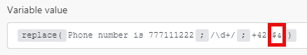

# Fonctions de chaîne

## [!UICONTROL length (text or buffer)]

Renvoie la longueur de la chaîne de texte (nombre de caractères) ou du buffer binaire (taille du buffer en octets).

>[!BEGINSHADEBOX]

**Exemple :**

`length( hello )`

Renvoie : 5

>[!ENDSHADEBOX]

## [!UICONTROL lower (text)]

Convertit en minuscules tous les caractères alphabétiques d’une chaîne de texte.

>[!BEGINSHADEBOX]

**Exemple :**

`lower( Hello )`

Renvoie : hello.

>[!ENDSHADEBOX]

## [!UICONTROL capitalize (text)]

Convertit le premier caractère d’une chaîne de texte en majuscules.

>[!BEGINSHADEBOX]

**Exemple :**

`capitalize( workfront )`

Renvoie : Workfront

>[!ENDSHADEBOX]

## [!UICONTROL startcase (texte)]

Met en majuscule la première lettre de chaque mot et toutes les autres lettres en minuscules.

>[!BEGINSHADEBOX]

**Exemple:**
`startcase( hello WORLD )`

Renvoie : [!UICONTROL Hello World].

>[!ENDSHADEBOX]

## [!UICONTROL ascii (text; [remove diacritics])]

Supprime tous les caractères non ascii d’une chaîne de texte.

>[!BEGINSHADEBOX]

**Exemples :**

* `ascii(` `Wěošrčkřfžrýoáníté` `)`

Renvoie : Workfront

* `ascii(` `ěščřž` `;` `true` `)`

Renvoie : [!UICONTROL escrz].

>[!ENDSHADEBOX]

## [!UICONTROL replace (text;search string; replacement string)]

Remplace la chaîne de recherche par la nouvelle chaîne.

>[!BEGINSHADEBOX]

**Exemple :**

`replace( Hello World ; Hello ; Hi )`

Renvoie : [!UICONTROL Hi World]

>[!ENDSHADEBOX]

Des expressions régulières (incluses dans `/.../`) peuvent être utilisées comme chaîne de recherche avec une combinaison d’indicateurs ajoutés (comme `g`, `i`, `m`) :

>[!BEGINSHADEBOX]

**Exemple :**

Tous ces nombres X X X X sont remplacés par X

>[!ENDSHADEBOX]

La chaîne de remplacement peut inclure les modèles de remplacement spéciaux suivants :

* `$&` insère la sous-chaîne correspondante.
* `$n` insère la nième chaîne de sous-matchs entre parenthèses lorsque n est un entier positif inférieur à 100. Il s’agit d’une indexation à partir de 1.

>[!BEGINSHADEBOX]

**Exemples :**

Renvoie : numéro de téléphone : `+420777111222`

Renvoie : numéro de téléphone : `+420777111222`

>[!CAUTION]
>
>N’utilisez pas de groupes de capture nommés tels que `/ is (?<number>\d+)/` dans l’argument de chaîne de remplacement. Cela entraîne une erreur.

>[!ENDSHADEBOX]

Pour plus d’informations sur les expressions régulières, consultez la section [Analyseur de texte](/help/workfront-fusion/references/apps-and-modules/tools-and-transformers/text-parser.md).

## [!UICONTROL trim (texte)]

Supprime les espaces au début ou à la fin du texte.

## [!UICONTROL upper (texte)]

Convertit en majuscules tous les caractères alphabétiques d’une chaîne de texte.

>[!BEGINSHADEBOX]

**Exemple :**

`upper( Hello )`

Renvoie : [!UICONTROL HELLO]

>[!ENDSHADEBOX]

## [!UICONTROL substring (text; start;end)]

Renvoie une partie d’une chaîne de texte entre la position « début » et la position « fin ».

>[!BEGINSHADEBOX]

**Exemples :**

* `substring( Hello ; 0 ; 3)`

  Renvoie : Hel

* `substring( Hello ; 1 ; 3 )`

  Renvoie : el

>[!ENDSHADEBOX]

## [!DNL indexOf (string; value; [start])]

Renvoie la position de la première occurrence d’une valeur spécifiée dans une chaîne. Cette méthode renvoie « -1 » si la valeur recherchée n’est pas présente. La valeur de début indique où la recherche doit commencer dans la chaîne.

>[!BEGINSHADEBOX]

**Exemples :**

* `indexOf( Workfront ; o )`

  Renvoie : 1

* `indexOf( Workfront ; x )`

  Renvoie : -1

* `indexOf( Workfront ; o ; 3 )`

  Renvoie : 6

>[!ENDSHADEBOX]

## [!UICONTROL toBinary (valeur)]

Convertit n’importe quelle valeur en données binaires.

Vous pouvez également indiquer le codage comme second argument pour appliquer des conversions binaires de hex ou base64 aux données binaires.

>[!BEGINSHADEBOX]

**Exemples :**

* `toBinary( Workfront )`

  Renvoie : 57 6f 72 6b 66 72 6f 6e 74

* `toBinary( V29ya2Zyb250 ; base64 )`

  Renvoie : 57 6f 72 6b 66 72 6f 6e 74

>[!ENDSHADEBOX]

## [!UICONTROL toString (valeur)]

Convertit n’importe quelle valeur en chaîne.

## [!UICONTROL encodeURL (texte)]

Code les caractères spéciaux en texte à une adresse URL valide.

## [!UICONTROL decodeURL (texte)]

Décode les caractères spéciaux d’une URL en texte.

>[!BEGINSHADEBOX]

**Exemple:**
`decodeURL( Automate%20your%20workflow )`

Renvoie : [!UICONTROL Automate your workflow] (automatiser votre workflow).

>[!ENDSHADEBOX]

## [!UICONTROL escapeHTML (texte)]

Échappe toutes les balises de HTML dans le texte.

>[!BEGINSHADEBOX]

**Exemple :**

`escapeHTML( <b>Hello</b> )`

Renvoie : `&lt;b&gt;Hello&lt;/b&gt;`

>[!ENDSHADEBOX]

## [!UICONTROL escapeMarkdown(texte)]

Permet d’ignorer toutes les balises Markdown dans le texte.

>[!BEGINSHADEBOX]

**Exemple :**

`escapeMarkdown( # Header )`

Renvoie : `&#35; Header`

>[!ENDSHADEBOX]

## [!UICONTROL stripHTML (texte)]

Supprime toutes les balises de HTML du texte.

>[!BEGINSHADEBOX]

**Exemple :**

`stripHTML( <b>Hello</b> )`

Renvoie : Hello

>[!ENDSHADEBOX]

## contains (texte; chaîne de recherche)

Vérifie si le texte contient la chaîne de recherche.

>[!BEGINSHADEBOX]

**Exemples :**

* `contains( Hello World ; Hello )`

  Renvoie : [!UICONTROL true]

* `contains( Hello World ; Bye )`

  Renvoie : [!UICONTROL false]

>[!ENDSHADEBOX]

## [!UICONTROL split (texte; séparateur)]

Divise une chaîne en une séquence de chaînes de caractères en la séparant en sous-chaînes.

>[!BEGINSHADEBOX]

**Exemple :**

`split( John, George, Paul ; , )`

>[!ENDSHADEBOX]

## [!UICONTROL md5 (text)]

Calcule le hachage md5 d’une chaîne.

>[!BEGINSHADEBOX]

**Exemple :**

`md5( Workfront )`

Renvoie : `1448bbbeaa7a9b8091d426999f1f666b`

>[!ENDSHADEBOX]

## [!UICONTROL sha1 (text; [encoding]; [key])]

Calcule le hachage sha1 d’une chaîne. Si l’argument key est spécifié, le hachage HMAC sha1 est renvoyé à la place. Codages pris en charge : « hex » (par défaut), « base64 » ou « latin1 ».

>[!BEGINSHADEBOX]

**Exemple :**

`sha1( workfront )`

Renvoie : b2b30b8ae1f9e5b40fbb0696eaabdbfd8d0c087f

>[!ENDSHADEBOX]

## [!UICONTROL sha256 (text; [encoding]; [key])]

Calcule le hachage sha256 d’une chaîne. Si l’argument key est spécifié, le hachage HMAC sha256 est renvoyé à la place. Codages pris en charge : « hex » (par défaut), « base64 » ou « latin1 ».>

>[!BEGINSHADEBOX]

**Exemple :**

`sha256( workfront )`

Renvoie : ed3d7397eec7b94453035b67ba4468c83ee3bedeb57137f7371f2e0cf5e2bbc

>[!ENDSHADEBOX]

## [!UICONTROL sha512 (texte; [codage de sortie]; [clé]; [codage de la clé])]

Calcule le hachage sha512 d’une chaîne. Si l’argument clé est spécifié, le hachage sha512 HMAC est renvoyé à la place.

Codages pris en charge :

* « [!UICONTROL hex] » (par défaut)
* « [!UICONTROL base64] »
* « [!UICONTROL latin1] »

Codages de clé pris en charge :

* « [!UICONTROL text] » (par défaut)
* « [!UICONTROL hex] »
* « [!UICONTROL base64] » ou « [!UICONTROL binary] »

Lors de l’utilisation du codage de clé [!UICONTROL binary], une clé doit être un buffer, pas une chaîne.

>[!BEGINSHADEBOX]

**Exemple :**

`sha512(workfront)`

Renvoie : 789ae41b9456357e4f27c6a09956a767abbb8d80b206003ffdd1e94dbc687cd119b85e1e19db58bb44b234493af35fd431639c0345aadf2cf7ec26e9f4a7fb19

>[!ENDSHADEBOX]

## [!UICONTROL base64 (texte)]

Transforme le texte en base64.

>[!BEGINSHADEBOX]

**Exemple :**

`base64( workfront )`

Renvoie : d29ya2Zyb250==

>[!ENDSHADEBOX]
