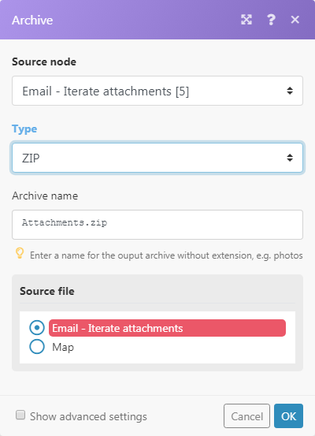

# Module [!UICONTROL Aggregator]

Un module agrégateur est un module qui fusionne plusieurs lots de données en un seul lot.

## Conditions d’accès

+++ Développez pour afficher les exigences d’accès aux fonctionnalités de cet article.

Vous devez disposer des accès suivants pour utiliser les fonctionnalités de cet article :

<table style="table-layout:auto">
 <col> 
 <col> 
 <tbody> 
  <tr> 
    <td role="rowheader">[!DNL Adobe Workfront] paquet</td> 
   <td> 
Tous
 </td> 
  </tr> 
  <tr data-mc-conditions=""> 
   <td role="rowheader">[!DNL Adobe Workfront] licence</td> 
   <td> Nouveau : Standard
Ou

Actuellement : Travail ou licence supérieure
 </td> 
  </tr> 
  <tr> 
   <td role="rowheader">[!UICONTROL Adobe Workfront Fusion] licence</td> 
   <td>
   
Actuelle : aucune exigence de licence [!DNL Workfront Fusion] requise.

   
Ou

   
Héritée : n’importe laquelle. 

   </td> 
  </tr> 
  <tr> 
   <td role="rowheader">Produit</td> 
   <td>
   
Nouveau :
 <ul><li>[!UICONTROL Select] ou [!UICONTROL Prime] plan de [!DNL Workfront] : votre entreprise doit acheter des [!DNL Adobe Workfront Fusion].</li><li>[!UICONTROL Ultimate] [!DNL Workfront] plan : [!DNL Workfront Fusion] est inclus.</li></ul>
   
Ou

   
Actuel : votre entreprise doit acheter [!DNL Adobe Workfront Fusion].

   </td> 
  </tr>
 </tbody> 
</table>

Pour connaître la formule, le type de licence ou l’accès dont vous disposez, contactez votre équipe d’administration [!DNL Workfront].

Pour plus d’informations sur les licences Adobe Workfront Fusion, voir [[!DNL Adobe Workfront Fusion] licences](/help/workfront-fusion/set-up-and-manage-workfront-fusion/licensing-operations-overview/license-automation-vs-integration.md).

+++

## Présentation du module [!UICONTROL Aggregator]

Lorsqu’un module [!UICONTROL Aggregator] s’exécute, il effectue les opérations suivantes :

* Cumule tous les lots à partir de l’opération d’un seul module source.
* Génère un lot unique avec un tableau contenant un élément par lot accumulé. Le contenu des éléments du tableau dépend du module de [!UICONTROL Aggregator] particulier et de sa configuration.

L’image suivante présente une configuration type du module [!UICONTROL Aggregator] :

<table style="table-layout:auto">
 <col> 
 <col> 
 <tbody> 
  <tr> 
   <td> 
[!UICONTROL Source Module]
 </td> 
   <td> 
Module où commence l’agrégation des lots. Le module source est généralement un itérateur ou un module de recherche qui génère une série de lots.

Lorsque vous configurez le module source de l’agrégateur (et fermez la configuration de l’agrégateur), l’itinéraire entre le module source et le module d’agrégateur est enveloppé dans une zone grise, de sorte que vous pouvez voir clairement le début et la fin de l’agrégation. 
   
 
Pour plus d’informations sur les itérateurs, consultez <a href="/help/workfront-fusion/references/modules/iterator-module.md" class="MCXref xref">[!UICONTROL Iterator] module </a>.
 
   
Pour plus d’informations sur les modules de recherche, voir <a href="/help/workfront-fusion/get-started-with-fusion/understand-fusion/module-overview.md#search-modules" class="MCXref xref">Modules de recherche</a> dans la présentation des modules.
 </td> 
  </tr> 
  <tr> 
   <td> 
[!UICONTROL Target structure type]

(Applicable uniquement au module [!UICONTROL Array aggregator].)
 </td> 
   <td> 
 Structure cible dans laquelle les données sont agrégées. L’option par défaut, [!UICONTROL Custom], vous permet de choisir les éléments qui doivent être agrégés dans l’élément <code>Array </code> du lot de sortie du [!UICONTROL Array aggregator] :
 
  
 
Une fois que vous avez connecté d’autres modules après le module [!UICONTROL Array aggregator] et que vous êtes revenu à la configuration du module d’agrégation, le menu déroulant Type de structure de [!UICONTROL Target] contient tous les modules suivants et leurs champs qui sont de type « Tableau de collections ». 
Dans cet exemple, le champ [!UICONTROL Attachments] du module [!DNL Slack] &gt; [!UICONTROL Create a Message] s’affiche dans le champ Agrégateur de tableaux &gt; Type de structure de la cible . 
 
  
 </td> 
  </tr> 
  <tr> 
   <td>[!UICONTROL Aggregated fields]</td> 
   <td>Les champs que vous souhaitez inclure dans la sortie du module d’agrégation.</td> 
  </tr> 
  <tr> 
   <td> 
[!UICONTROL Group by]
 </td> 
   <td> 
À l’aide du champ Regrouper par , vous pouvez définir une expression contenant un ou plusieurs éléments mappés. Les données agrégées sont ensuite séparées en groupes par la valeur de l’expression. Chaque groupe génère un lot distinct, contenant une clé et un tableau de données. En regroupant les résultats, vous pouvez utiliser la clé comme filtre dans les modules suivants.

   
Chaque lot contient deux éléments :
 
    <ul> 
     <li><code>Key</code>: valeur par laquelle vous effectuez un regroupement.</li> 
     <li><code>Array</code>: données agrégées des lots pour lesquels la formule a été évaluée sur la valeur <code>Key</code>.</li> 
    </ul> </td> 
  </tr> 
  <tr> 
   <td> 
Arrêter le traitement après une agrégation vide
 </td> 
   <td> 
Par défaut, le module [!UICONTROL Aggregator] génère le résultat de l’agrégation même si aucun lot n’a atteint le module [!UICONTROL Aggregator] (par exemple, parce qu’ils ont tous été exclus du chemin qui inclut l’agrégateur). Si l’option [!UICONTROL Stop processing after an empty aggregation] est activée, le module [!UICONTROL Aggregator] ne génère aucun lot de sortie en l’absence de lots d’entrée. Au lieu de cela, le flux s'arrête.
 </td> 
  </tr> 
 </tbody> 
</table>

>[!NOTE]
>
>Les lots générés par les modules entre le module source et le module [!UICONTROL Aggregator] ne sont pas générés par le module [!UICONTROL Aggregator]. Ces lots ne sont pas accessibles par les modules dans le flux après la [!UICONTROL Aggregator]. Si vous avez besoin de données provenant d’un lot généré par un module entre le module source et le module [!UICONTROL Aggregator], veillez à inclure l’élément donné dans la configuration du module [!UICONTROL Aggregator] (par exemple dans le champ [!UICONTROL Aggregated fields] dans la configuration du module [!UICONTROL Array aggregator]).

## Exemple de scénario de fonctionnement des agrégateurs

Cet exemple de scénario montre comment compresser toutes les pièces jointes d’e-mail et charger le fichier ZIP vers [!DNL Dropbox].

Le scénario ci-dessous montre comment :

* Le premier module surveille une boîte aux lettres pour les e-mails entrants. Le déclencheur [!UICONTROL Email] >[!UICONTROL Watch emails] génère un lot avec l’élément `Attachments[]`, qui est un tableau contenant toutes les pièces jointes de l’e-mail.

* Le deuxième modèle itère les pièces jointes de l’e-mail : [!UICONTROL Email] >[!UICONTROL Iterate attachments] itérateur prend les éléments du tableau `Attachments[]` un par un et les envoie en tant que lots distincts.

* Le troisième module est l&#39;agrégateur. Il agrège les lots générés par le module [!UICONTROL Email] > [!UICONTROL Iterate attachments] . [!UICONTROL Archive] >[!UICONTROL Create an archive aggregator] accumule tous les lots qu’il reçoit et génère un seul lot contenant le fichier ZIP.

* Le dernier module charge le fichier ZIP obtenu dans [!DNL Dropbox].  [!DNL Dropbox] > [!UICONTROL Upload a file] récupère le fichier ZIP à partir du module [!UICONTROL Archive] > [!UICONTROL Create an archive] et le charge dans [!DNL Dropbox].

Vous trouverez ci-dessous un exemple de configuration de l’agrégateur [!UICONTROL Archive] > [!UICONTROL Create an archive] :

